# [Backend de almacenamiento en Vault](https://developer.hashicorp.com/vault/docs/configuration/storage)

`Vault` permite varias opciones para configurar el backend de almacenamiento, que representa la ubicación del
almacenamiento duradero de la información de `Vault`. Cada backend tiene ventajas, desventajas y pros y contras. Por
ejemplo, algunos backend admiten alta disponibilidad, mientras que otros ofrecen un proceso de copia de seguridad y
restauración más sólido.

Aquí te explico las principales opciones de almacenamiento en `Vault`:

1. `File System`: Puedes configurar `Vault` para almacenar datos en el sistema de archivos local del servidor donde se
   ejecuta. En este caso, los secretos se guardan en un archivo en el disco del servidor. `Vault` cifra los datos en el
   almacenamiento para que solo el propio servicio de `Vault` pueda descifrarlos.


2. `Backends de almacenamiento soportados`: `Vault` es compatible con diferentes backends de almacenamiento, que puedes
   elegir según las necesidades de tu infraestructura. Algunos de los más comunes son:

    - `Consul`: Este es el backend recomendado por `HashiCorp`. `Consul` es un sistema de almacenamiento distribuido y
      altamente disponible, y ofrece funciones adicionales como la detección de servicios, lo que lo hace ideal para
      entornos distribuidos.
    - `DynamoDB`: Permite almacenar secretos en `DynamoDB de AWS`, ideal para aplicaciones en `AWS` que requieren
      almacenamiento altamente disponible y escalable.
    - `MySQL/PostgreSQL`: Vault puede usar bases de datos como MySQL o PostgreSQL como backends de almacenamiento. Esto
      es útil si ya tienes bases de datos en uso y quieres centralizar el almacenamiento de secretos.
    - `In-Memory`: Para pruebas o uso temporal, Vault puede usar un almacenamiento en memoria. Sin embargo, este backend
      no persiste datos y se pierde al reiniciar el servicio de Vault.
    - `Azure Storage y Google Cloud Storage`: También soporta opciones de almacenamiento en la nube para usuarios de
      Azure y Google Cloud.


3. `Cifrado en el almacenamiento`: Independientemente del backend de almacenamiento que elijas, Vault cifra todos los
   datos antes de almacenarlos. Esto se hace mediante una clave de cifrado maestra generada y protegida internamente por
   Vault. Los datos permanecen cifrados incluso si alguien obtiene acceso directo al backend de almacenamiento. Vault
   solo descifra los datos cuando son solicitados y autorizados.


4. `Alta disponibilidad y replicación`: Algunos backends como `Consul y DynamoDB` ofrecen replicación y alta
   disponibilidad nativa, por lo que puedes configurarlos para redundancia y asegurar el acceso a los secretos en caso
   de que un servidor de `Vault` falle.

En general, el backend de almacenamiento es configurable en `Vault`, y puedes elegir el que mejor se adapte a tus
requisitos de rendimiento, disponibilidad y persistencia.

## [Backend de almacenamiento del sistema de archivos](https://developer.hashicorp.com/vault/docs/configuration/storage/filesystem)

El `backend` de almacenamiento del `sistema de archivos` almacena los datos de `Vault` en el `sistema de archivos`
mediante una estructura de directorio estándar. Se puede utilizar para situaciones de servidor único duradero o para
desarrollar localmente donde la durabilidad no es crítica.

- `Sin alta disponibilidad`: el backend del sistema de archivos no admite alta disponibilidad.
- `Compatible con HashiCorp`: el backend del sistema de archivos cuenta con el respaldo oficial de HashiCorp.

La configuración del backend de almacenamiento se realiza a través del archivo de configuración de `Vault` utilizando
la estrofa de almacenamiento.

````bash
storage "file" {
  path = "/mnt/vault/data"
}
````

- `path`, la ruta absoluta en el disco al directorio donde se almacenarán los datos. Si el directorio no existe, `Vault`
  lo creará.

Aunque los datos de `Vault` están encriptados en reposo, debes tomar las medidas adecuadas para proteger el acceso al
sistema de archivos.

## [Configuración de Vault](https://developer.hashicorp.com/vault/docs/configuration)

Fuera del modo de desarrollo, los servidores de `Vault` se configuran mediante un archivo. El formato de este archivo
es `hcl` o `json`.

> El formato `hcl` (HashiCorp Configuration Language) es un lenguaje de configuración utilizado por varias herramientas
> de `HashiCorp`, incluidas `Vault`, `Terraform`, `Consul` y `Packer`. `HCL` está diseñado para ser legible para
> humanos, con una sintaxis simple y clara, pero al mismo tiempo flexible y extensible para permitir configuraciones
> complejas.
>
> En el caso de `Vault`, el archivo `hcl` se utiliza para configurar parámetros como la ubicación de almacenamiento,
> los escuchadores `(listeners)`, la autenticación, las direcciones de API y otros ajustes relacionados con el
> servidor de `Vault`.
>
> `HCL` está diseñado para ser fácil de leer y escribir, con un formato claro basado en pares `clave-valor`, bloques
> de configuración y comentarios. En `HCL`, las configuraciones se agrupan en bloques. Un bloque tiene un tipo
> (por ejemplo, `storage`, `listener`, `ui`) seguido de un bloque de llaves `{ }` que contiene los parámetros de
> configuración.

Al habilitar la verificación de permisos de archivo a través de la variable de entorno
`VAULT_ENABLE_FILE_PERMISSIONS_CHECK`, `Vault` puede verificar si el directorio de configuración y los archivos son
propiedad del usuario que ejecuta `Vault`. También verifica si no hay permisos de escritura o ejecución para el grupo u
otros. `Vault` permite a los operadores especificar el usuario y los permisos del directorio de complementos y los
archivos binarios mediante los parámetros `plugin_file_uid` y `plugin_file_permissions` en la configuración si un
operador necesita que sean diferentes. Esta verificación está deshabilitada de forma predeterminada.

A continuación, se muestra un ejemplo de configuración:

````bash
ui            = true
cluster_addr  = "https://127.0.0.1:8201"
api_addr      = "https://127.0.0.1:8200"
disable_mlock = true

storage "raft" {
  path = "/path/to/raft/data"
  node_id = "raft_node_id"
}

listener "tcp" {
  address       = "127.0.0.1:8200"
  tls_cert_file = "/path/to/full-chain.pem"
  tls_key_file  = "/path/to/private-key.pem"
}

telemetry {
  statsite_address = "127.0.0.1:8125"
  disable_hostname = true
}
````

Después de escribir la configuración, use el indicador `-config` con el servidor de `Vault` para especificar dónde está
la configuración.

## Creando nuestro backend de almacenamiento del sistema de archivos

En el directorio donde tengo alojado la aplicación de `vault.exe` vamos a crear un archivo de configuración para `Vault`
llamado `vault-config.hcl`.

````bash
C:\vault_1.18.1
$ ls
vault.exe*  vault-config.hcl
````

En nuestro archivo `vault-config.hcl` agregaremos la siguiente configuración.

````bash
ui            = true
api_addr      = "http://127.0.0.1:8200" # Configura la dirección pública de la API

storage "file" {
  path = "C:\\vault_1.18.1\\data" # Especifica aquí el directorio donde quieres que Vault almacene los secretos
}

listener "tcp" {
  address     = "127.0.0.1:8200"  # Dirección y puerto en los que Vault escuchará
  tls_disable = "true"            # Desactiva TLS para pruebas locales, pero en producción se recomienda usar HTTPS
}
````

**Donde**

- `ui=true`, este parámetro habilita la interfaz web de Vault, lo cual te permitirá acceder a la UI de Vault a través
  del navegador.
- `api_addr="http://127.0.0.1:8200"`, define la dirección pública que los clientes (y usuarios) usan para interactuar
  con Vault a través de su API HTTP. Es la URL completa que Vault usa para exponer su API, y es importante si tienes
  Vault accesible desde fuera de la máquina o si quieres configurarlo para entornos distribuidos.
- `storage "file"`, almacena los secretos en el sistema de archivos.
- `path="C:\\vault_1.18.1\\data"`, especifica el directorio donde Vault almacenará los secretos. Si el directorio no
  existe, `Vault` lo creará.
- `listener "tcp"`.
    - `address`, configura Vault para escuchar en `127.0.0.1:8200`, lo cual está bien para pruebas locales.
    - `tls_disable="true"`, desactiva `TLS`, lo cual es conveniente para pruebas locales, pero no es seguro para un
      entorno de producción. En producción, siempre es recomendable usar `HTTPS`.


- `api_addr`, dirección pública que los clientes usan para conectarse a Vault.
- `address`, dirección en la que Vault escucha las solicitudes locales.

## Iniciando servidor Vault con el sistema de archivos como backend de almacenamiento

Antes de iniciar el servidor, observemos que tenemos el directorio donde está alojado `vault.exe` y nuestro archivo de
configuración `vault-config.hcl`.

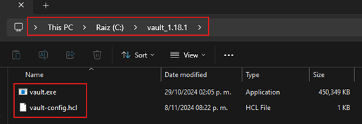

Ahora, procedemos a levantar el servidor de vault especificando el archivo de configuración. Observemos que en los
detalles de la configuración vemos que en el `Storage` se está usando el `file` (nuestro sistema de archivos como
backend de almacenamiento).

````bash
C:\vault_1.18.1
$ vault server -config C:\vault_1.18.1\vault-config.hcl

WARNING! mlock is not supported on this system! An mlockall(2)-like syscall to
prevent memory from being swapped to disk is not supported on this system. For
better security, only run Vault on systems where this call is supported. If
you are running Vault in a Docker container, provide the IPC_LOCK cap to the
container.
==> Vault server configuration:

Administrative Namespace:
             Api Address: http://127.0.0.1:8200
                     Cgo: disabled
         Cluster Address: https://127.0.0.1:8201
   Environment Variables: , , , , , , , ALLUSERSPROFILE, ANSICON, ANSICON_DEF, APPDATA, CLINK_COMPLETIONS_DIR, CMDER_ALIASES, CMDER_CLINK, CMDER_CONFIGURED, CMDER_CONFIG_DIR, CMDER_INIT_END, CMDER_INIT_START, CMDER_ROOT, CMDER_SHELL, CMDER_USER_FLAGS, COLUMNS, COMPUTERNAME, ChocolateyInstall, ChocolateyLastPathUpdate, ComSpec, CommonProgramFiles, CommonProgramFiles(x86), CommonProgramW6432, ConEmuANSI, ConEmuAnsiLog, ConEmuArgs, ConEmuArgs2, ConEmuBackHWND, ConEmuBaseDir, ConEmuBaseDirShort, ConEmuBuild, ConEmuCfgDir, ConEmuConfig, ConEmuDir, ConEmuDrawHWND, ConEmuDrive, ConEmuHWND, ConEmuHooks, ConEmuPID, ConEmuPalette, ConEmuServerPID, ConEmuTask, ConEmuWorkDir, ConEmuWorkDrive, DataGrip, DriverData, EFC_19012, ESC, GIT_INSTALL_ROOT, GIT_VERSION_USER, HOME, HOMEDRIVE, HOMEPATH, IntelliJ IDEA Community Edition, JAVA_HOME, LANG, LINES, LOCALAPPDATA, LOGONSERVER, MAVEN_HOME, NUMBER_OF_PROCESSORS, NVM_HOME, NVM_SYMLINK, OLD_PATH, OS, OneDrive, PASSWORD_MS_CONFIG_SERVER, PATHEXT, PLINK_PROTOCOL, POSH_INSTALLER, POSH_THEMES_PATH, PROCESSOR_ARCHITECTURE, PROCESSOR_IDENTIFIER, PROCESSOR_LEVEL, PROCESSOR_REVISION, PROMPT, PSModulePath, PUBLIC, Path, ProgramData, ProgramFiles, ProgramFiles(x86), ProgramW6432, SESSIONNAME, SVN_SSH, SystemDrive, SystemRoot, TEMP, TMP, USERDOMAIN, USERDOMAIN_ROAMINGPROFILE, USERNAME, USERPROFILE, USER_BUILD, USER_MAJOR, USER_MINOR, USER_PATCH, VAULT_ADDR, ZES_ENABLE_SYSMAN, add_path, add_to_path, aliases, architecture_bits, ccall, cexec, clink_architecture, clink_dummy_capture_env, currenArgu, debug_output, depth, fast_init, feFlagName, feNot, find_query, found, full_path, git_executable, git_locale, lib_base, lib_console, lib_git, lib_path, lib_profile, max_depth, nix_tools, path_position, position, print_debug, print_error, print_verbose, print_warning, time_init, user_aliases, verbose_output, windir
              Go Version: go1.22.8
              Listener 1: tcp (addr: "127.0.0.1:8200", cluster address: "127.0.0.1:8201", disable_request_limiter: "false", max_request_duration: "1m30s", max_request_size: "33554432", tls: "disabled")
               Log Level:
                   Mlock: supported: false, enabled: false
           Recovery Mode: false
                 Storage: file
                 Version: Vault v1.18.1, built 2024-10-29T14:21:31Z
             Version Sha: f479e5c85462477c9334564bc8f69531cdb03b65

==> Vault server started! Log data will stream in below:

2024-11-08T20:39:25.134-0500 [INFO]  proxy environment: http_proxy="" https_proxy="" no_proxy=""
2024-11-08T20:39:25.136-0500 [INFO]  incrementing seal generation: generation=1
2024-11-08T20:39:25.137-0500 [INFO]  core: Initializing version history cache for core
2024-11-08T20:39:25.137-0500 [INFO]  events: Starting event system
````

Ahora nos vamos a dirigir al navegador e ingresar a la web de `Vault`. Configuramos según nuestro criterio, en mi caso
decidí que se deberían crear 3 claves de las cuales, pueda usar 2 para validar la llave raíz.

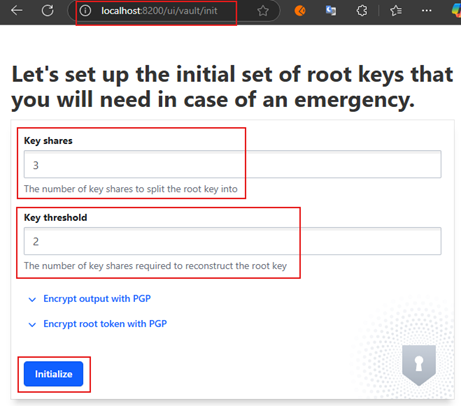

- `Key shares (partes clave)`, la cantidad de partes de clave en las que se dividirá la clave raíz.
- `Key threshold (umbral de clave)`, la cantidad de partes de clave necesarias para reconstruir la clave raíz.

Al dar clic en el botón `Initilize` ocurrirán dos cosas. La primera es que se nos mostrará la siguiente pantalla con
las 3 claves y el token raíz.

El mensaje que se muestra al inicio de la pantalla dice:

> ¡Se ha inicializado el almacén! Aquí tienes las 3 claves.
>
> Distribuye las claves de forma segura a continuación. Cuando se vuelva a sellar, reiniciar o detener el almacén, debes
> proporcionar al menos 2 de estas claves para abrirlo de nuevo. `Vault` no almacena la clave raíz. Sin al menos 2
> claves, `Vault` permanecerá sellado de forma permanente.

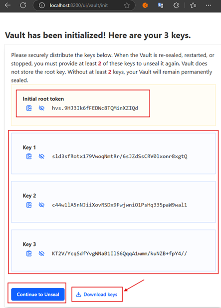

Si damos en `Download Keys` se nos descargará un archivo `json` llamado
`vault-cluster-vault-2024-11-09T01_52_39.618Z.json`. El contenido de este archivo `json` es tal cual se muestra a
continuación.

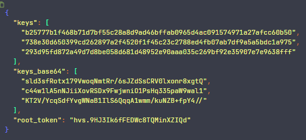

Se muestran las 3 llaves en texto plano y en su correspondiente base64, además se muestra el root token.

La segunda cosa que ocurre es que se nos crea el directorio que especificamos en el `path = "C:\\vault_1.18.1\\data"`
del `storage file` tal como se muestra en la siguiente imagen.

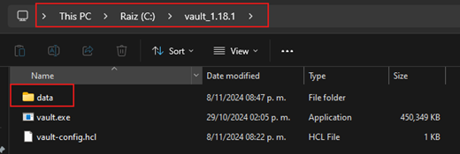

Luego de dar clic en el botón `Continue to Unseal` se nos mostrará la siguiente pantalla donde menciona.
> Desbloquear Vault<br>
> Vault está sellado<br>
> Desbloquee Vault ingresando partes de la clave de desbloqueo. Esto se puede hacer a través de múltiples mecanismos en
> múltiples computadoras. Una vez que se ingresan todas las partes, se descifrará la clave raíz y Vault se desbloqueará.

Ingresamos uno a uno las keys que se nos proporcionó anteriormente.

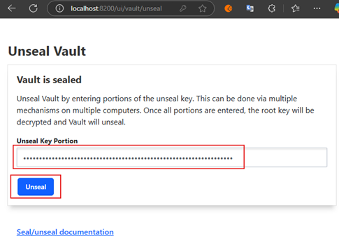

Como observamos, solo es necesario agregar 2 de las 3 keys generadas. Esto es posible gracias a la configuración que
le hicimos al `Key threshold` donde le dijimos que necesitamos al menos 2 key para desbloquear `Vault`.

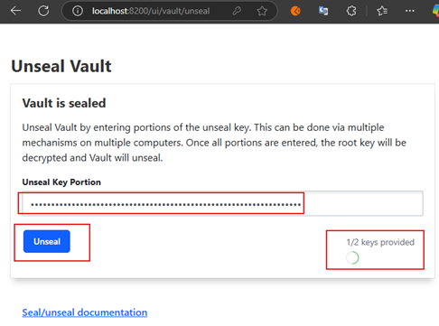

Luego de proporcionar una segunda key damos en `Unseal` y nos redireccionará a la pantalla para iniciar sesión con el
token que nos proporcionó.

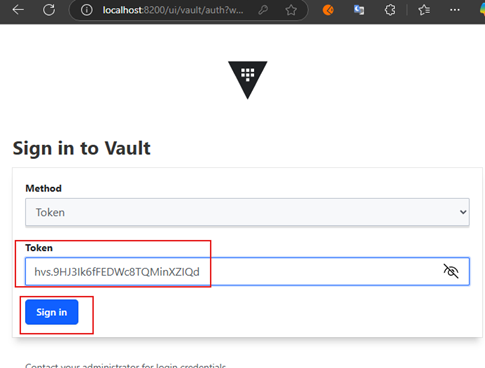

Finalmente, nos autenticamos correctamente y somos redireccionados al dashboard principal de `Vault`.

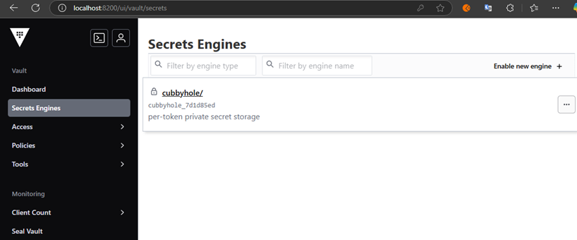

## Registrando configuraciones en Vault

Vamos a registrar dos configuraciones en `Vault`. La forma de registrar ya lo hemos visto en proyectos anteriores, así
que solo mostraré como quedarían las configuraciones.

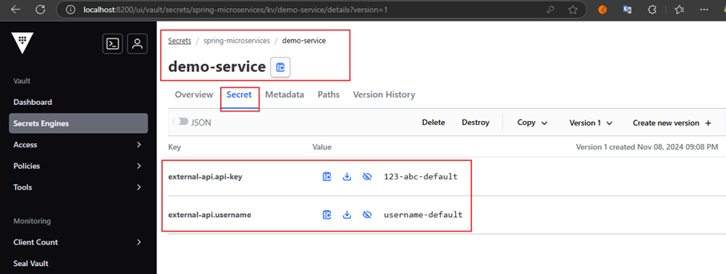

Ahora, dejaré de ejecutar el servidor de `Vault` y lo volveré a iniciar para comprobar si las configuraciones se han
quedado persistentes.

Volvemos a iniciar el servidor de `Vault`.

````bash
C:\vault_1.18.1
$ vault server -config C:\vault_1.18.1\vault-config.hcl

WARNING! mlock is not supported on this system! An mlockall(2)-like syscall to
prevent memory from being swapped to disk is not supported on this system. For
better security, only run Vault on systems where this call is supported. If
you are running Vault in a Docker container, provide the IPC_LOCK cap to the
container.
==> Vault server configuration:

Administrative Namespace:
             Api Address: http://127.0.0.1:8200
                     Cgo: disabled
         Cluster Address: https://127.0.0.1:8201
   Environment Variables: , , , , , , , ALLUSERSPROFILE, ANSICON, ANSICON_DEF, APPDATA, CLINK_COMPLETIONS_DIR, CMDER_ALIASES, CMDER_CLINK, CMDER_CONFIGURED, CMDER_CONFIG_DIR, CMDER_INIT_END, CMDER_INIT_START, CMDER_ROOT, CMDER_SHELL, CMDER_USER_FLAGS, COLUMNS, COMPUTERNAME, ChocolateyInstall, ChocolateyLastPathUpdate, ComSpec, CommonProgramFiles, CommonProgramFiles(x86), CommonProgramW6432, ConEmuANSI, ConEmuAnsiLog, ConEmuArgs, ConEmuArgs2, ConEmuBackHWND, ConEmuBaseDir, ConEmuBaseDirShort, ConEmuBuild, ConEmuCfgDir, ConEmuConfig, ConEmuDir, ConEmuDrawHWND, ConEmuDrive, ConEmuHWND, ConEmuHooks, ConEmuPID, ConEmuPalette, ConEmuServerPID, ConEmuTask, ConEmuWorkDir, ConEmuWorkDrive, DataGrip, DriverData, EFC_19012, ESC, GIT_INSTALL_ROOT, GIT_VERSION_USER, HOME, HOMEDRIVE, HOMEPATH, IntelliJ IDEA Community Edition, JAVA_HOME, LANG, LINES, LOCALAPPDATA, LOGONSERVER, MAVEN_HOME, NUMBER_OF_PROCESSORS, NVM_HOME, NVM_SYMLINK, OLD_PATH, OS, OneDrive, PASSWORD_MS_CONFIG_SERVER, PATHEXT, PLINK_PROTOCOL, POSH_INSTALLER, POSH_THEMES_PATH, PROCESSOR_ARCHITECTURE, PROCESSOR_IDENTIFIER, PROCESSOR_LEVEL, PROCESSOR_REVISION, PROMPT, PSModulePath, PUBLIC, Path, ProgramData, ProgramFiles, ProgramFiles(x86), ProgramW6432, SESSIONNAME, SVN_SSH, SystemDrive, SystemRoot, TEMP, TMP, USERDOMAIN, USERDOMAIN_ROAMINGPROFILE, USERNAME, USERPROFILE, USER_BUILD, USER_MAJOR, USER_MINOR, USER_PATCH, VAULT_ADDR, ZES_ENABLE_SYSMAN, add_path, add_to_path, aliases, architecture_bits, ccall, cexec, clink_architecture, clink_dummy_capture_env, currenArgu, debug_output, depth, fast_init, feFlagName, feNot, find_query, found, full_path, git_executable, git_locale, lib_base, lib_console, lib_git, lib_path, lib_profile, max_depth, nix_tools, path_position, position, print_debug, print_error, print_verbose, print_warning, time_init, user_aliases, verbose_output, windir
              Go Version: go1.22.8
              Listener 1: tcp (addr: "127.0.0.1:8200", cluster address: "127.0.0.1:8201", disable_request_limiter: "false", max_request_duration: "1m30s", max_request_size: "33554432", tls: "disabled")
               Log Level:
                   Mlock: supported: false, enabled: false
           Recovery Mode: false
                 Storage: file
                 Version: Vault v1.18.1, built 2024-10-29T14:21:31Z
             Version Sha: f479e5c85462477c9334564bc8f69531cdb03b65

==> Vault server started! Log data will stream in below:

2024-11-08T21:11:44.238-0500 [INFO]  proxy environment: http_proxy="" https_proxy="" no_proxy=""
2024-11-08T21:11:44.241-0500 [INFO]  incrementing seal generation: generation=1
2024-11-08T21:11:44.243-0500 [INFO]  core: Initializing version history cache for core
2024-11-08T21:11:44.243-0500 [INFO]  events: Starting event system
````

Nos dirigimos a la web de `Vault` y ahora nos pide directamente que le mostremos las keys.

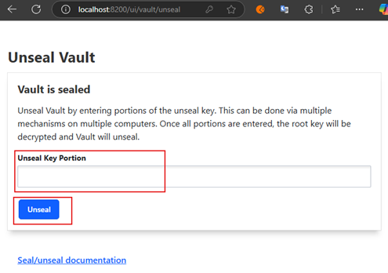

Luego de mostrarle 2 keys, me manda a la página de inicio de sesión para proporcionarle el token.

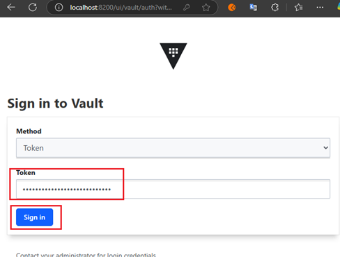

Observamos que las configuraciones aún se mantienen confirmándonos la persistencia de los mismos.

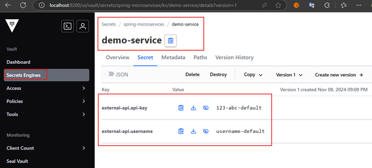

