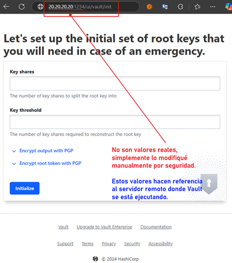

# Instala Vault en servidor de Linux

---

### 1. Conectar al servidor remoto

Nos vamos a conectar al servidor remoto de linux, en mi caso usando la aplicación `MobaXterm` (edición portable) y
dentro de él, nos iremos al siguiente directorio donde alojaremos a `Vault`.

````bash
$ /var/opt/teradata/software/vault/
````

Para determinar qué arquitectura tiene el servidor remoto de Linux, ejecutamos el siguiente comando en la terminal del
servidor.

````bash
$ uname -m
x86_64
````

Este comando te mostrará el tipo de arquitectura de tu máquina. Dependiendo del resultado, elegirás la opción correcta:

- Si el resultado es `x86_64`, significa que tu servidor tiene una arquitectura de `64 bits (AMD64)`, por lo que debes
  descargar la versión `amd64` de `Vault`.
- Si el resultado es `i386 o i686`, significa que tu servidor tiene una arquitectura de `32 bits`, por lo que debes
  elegir la opción `386`.
- Si el resultado es `armv7l`, significa que tienes una arquitectura `ARM de 32 bits`, y debes elegir la opción `ARM`.
- Si el resultado es `aarch64`, indica que tienes una arquitectura `ARM de 64 bits`, y debes elegir la opción `ARM64`.

### 2. Descargar Vault en el Servidor Remoto

Una vez dentro del servidor remoto, podemos usar el siguiente comando para descargarlo directamente teniendo en cuenta
la arquitectura identificada en el paso anterior.

````bash
$ wget https://releases.hashicorp.com/vault/1.18.1/vault_1.18.1_linux_amd64.zip
````

En mi caso no usaré el comando anterior, sino más bien, descargaré el `vault_1.18.1_linux_amd64.zip` en mi máquina local
de `windows` desde [install linux](https://developer.hashicorp.com/vault/install#linux) y luego lo subiré al servidor
remoto de linux usando el `MobaXterm`, dado que me resulta más fácil hacerlo de esa manera.

### 3. Extraer Vault

Descomprimimos el archivo `vault_1.18.1_linux_amd64.zip`.

````bash
$ unzip vault_1.18.1_linux_amd64.zip
Archive:  vault_1.18.1_linux_amd64.zip
  inflating: vault
  inflating: LICENSE.txt
````

Esto descomprimirá el archivo ejecutable `vault` en la ruta donde actualmente nos encontramos. Si listamos el contenido
del directorio actual, veremos nuestro ejecutable `vault` descomprimido.

````bash
$ ls
LICENSE.txt  vault  vault_1.18.1_linux_amd64.zip
````

### 4. Configura Vault

Para continuar con esta documentación, colocaré valores ficticios del servidor remoto en las configuraciones que haré
sobre `Vault`.

- `Valor ficticio del servidor de linux`: 20.20.20.20
- `Valor ficticio del puerto a asignar a vault`: 1234

En nuestra máquina local creamos un archivo llamado `vault-config.hcl` y le agregamos las siguientes configuraciones.

````bash
ui            = true
api_addr      = "http://20.20.20.20:1234"

storage "file" {
  path = "/var/opt/teradata/software/vault/data"
}

listener "tcp" {
  address     = "0.0.0.0:1234"  # Escuchar en todas las interfaces de red para permitir el acceso remoto
  tls_disable = "true"          # Desactiva TLS (solo en entornos seguros o de desarrollo)
}
````

Luego, subimos el archivo `vault-config.hcl` a la ruta donde tenemos alojado `Vault`, en nuestro caso sería la
siguiente ruta `/var/opt/teradata/software/vault/` de nuestro servidor remoto de linux. Si listamos el contenido
del directorio actual, veremos que está tanto nuestro ejecutable de `Vault` como nuestro archivo de configuración
`vault-config.hcl`.

````bash
$ ls
LICENSE.txt  vault  vault-config.hcl  vault_1.18.1_linux_amd64.zip
````

### 5. Inicia Vault

Ejecutamos `Vault` con el archivo de configuración que acabamos de subir al servidor remoto de linux.

````bash
$ vault server -config /var/opt/teradata/software/vault/vault-config.hcl
````

Con el siguiente comando verificamos si hay algún servicio o proceso que esté escuchando en el puerto `1234` en el
servidor Linux, y da detalles sobre la conexión.

````bash
$ sudo ss -tuln | grep 1234
tcp    0      128                         *:1234                       *:*
````

- `sudo`, ejecuta el comando con privilegios de superusuario (root). Algunas de las acciones relacionadas con la red,
  como ver puertos en uso o abrir sockets, requieren permisos elevados.
- `ss`, es una herramienta de línea de comandos en `Linux` que se utiliza para mostrar información sobre conexiones de
  red (sockets) de manera más rápida y eficiente que el comando `netstat`. Este comando reemplaza a `netstat` en muchas
  distribuciones de Linux más modernas.
- `-tuln`, estas son las opciones proporcionadas al comando ss:
    - `-t`: Muestra las conexiones TCP (en lugar de UDP, que es el tipo de protocolo por defecto).
    - `-u`: Muestra las conexiones UDP.
    - `-l`: Muestra solo los puertos en escucha (Listening ports), es decir, los puertos en los que los servicios están
      esperando conexiones entrantes.
    - `-n`: Muestra las direcciones y puertos en formato numérico, en lugar de intentar resolver los nombres de host o
      servicios (lo cual podría hacer que el comando sea más lento).
- `|`, el pipe `(|)` se utiliza para enviar la salida de un comando como entrada a otro comando. En este caso, la salida
  de ss `-tuln` se pasa a `grep`, que filtra y muestra solo las líneas que contienen el puerto `1234`.
- `grep 1234`, `grep` es una herramienta de búsqueda que filtra las líneas que contienen un patrón específico. En este
  caso, `grep 1234` filtra y muestra solo las líneas que contienen el número `1234`, lo que puede ser útil si estás
  buscando un proceso o servicio que esté escuchando en el puerto `1234`.

Este resultado significa que hay un servicio `(en nuestro caso Vault)` que está escuchando en el puerto `1234` de tu
servidor en todos los interfaces de red, y está preparado para aceptar conexiones entrantes desde cualquier IP y puerto.

### 6. Accede a Vault desde mi máquina local

En nuestra máquina local, abrimos un navegador y nos dirigimos a la siguiente dirección `http://20.20.20.20:1234/ui`,
a continuación veremos que se nos muestra la interfaz de vault donde procedemos a realizar el proceso de autenticación.

**Nota**
> Recordar que para obtener la imagen que se muestra a continuación sí usé la ip y puerto real del servidor. Pero
> para colocar la imagen en esta documentación cambién manualmente la ip y el puerto por los valores ficticios que se
> muestran.



### 7. Configura TLS para mayor seguridad (opcional)

Para un entorno de producción, se recomienda habilitar `TLS` en `Vault` para asegurar la comunicación. En el archivo
`vault-config.hcl`, configura el bloque listener con `tls_cert_file` y `tls_key_file` apuntando a tus archivos de
certificado `TLS`.

````bash
listener "tcp" {
  address = "0.0.0.0:1234"
  tls_cert_file = "/ruta/al/certificado.pem"
  tls_key_file  = "/ruta/a/la/llave.pem"
}
````

Luego, desde tu máquina local, accederías a la UI de Vault mediante `HTTPS`:

````bash
$ https://20.20.20.20:1234/ui
````

## Deteniendo servicio de Vault

Si `Vault` fue iniciado directamente desde la línea de comandos en segundo plano, puedes buscar el proceso de `Vault`
y detenerlo manualmente. Sigue estos pasos:

1. `Busca el PID (ID de proceso) de Vault`: Ejecuta el siguiente comando para encontrar el proceso de `Vault` en
   ejecución:

    ````bash
    $ ps aux | grep vault
    
    root      2904  0.2  0.6 1619816 449684 ?      SLl  12:44   0:16 vault server -config /var/opt/teradata/software/vault/vault-config.hcl
    root     21062  0.0  0.0   4556   824 pts/1    S+   14:29   0:00 grep vault
    ````
   En este caso, el proceso que debemos detener es el primero. El `PID (Process ID)` de este proceso es `2904`. El otro
   proceso que aparece `(21062)` es simplemente el comando `grep vault` que acabamos de ejecutar para buscar los
   procesos relacionados con `Vault`, así que no es necesario detenerlo.


2. Para detener `Vault`, ejecutamos el siguiente comando.

    ````bash
    $ sudo kill 2904
    ````

3. Comprobamos que el proceso ya no esté activo. Observamos que ahora solo nos muestra un resultado, que corresponde al
   mismo comando `grep vault` que acabamos de ejecutar.

    ````bash
    $ ps aux | grep vault
    root     22369  0.0  0.0   4552   564 pts/1    S+   14:36   0:00 grep vault
    ````
