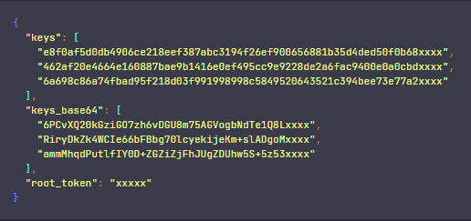

# Generar un nuevo Root Token si el Root Token anterior fue revocado por error

Por error he revocado el `root_token` usando el siguiente comando.

````bash
$ vault token revoke <root-token> 
````

Entonces, ahora ya no se puede iniciar sesión mediante la web de Vault ni mucho menos hacer uso de la línea de comandos.

Revocar el token raíz de Vault puede ser problemático porque es el token con los permisos más elevados en tu sistema
Vault. Sin este token, podrías encontrarte sin la capacidad de administrar tu servidor Vault, a menos que existan otros
métodos de autenticación o usuarios con permisos administrativos configurados.

Veamos cómo podemos generar un nuevo Root Token a partir de las claves generadas cuando se inició vault por primera vez.

1. `Desprecinta Vault (si está precintado)`. Verifica con el siguiente comando si Vault está precintado.

````bash
$ vault status
Key             Value
---             -----
Seal Type       shamir
Initialized     true
Sealed          false
Total Shares    3
Threshold       2
Version         1.18.1
Build Date      2024-10-29T14:21:31Z
Storage Type    file
Cluster Name    vault-cluster-62771dea
Cluster ID      16a857e7-6f45-bbae-e0c4-bc8dd1f2b53e
HA Enabled      false
````

Si dice `Sealed: true`, desprecinta Vault utilizando las claves proporcionadas. Necesitarás al menos un umbral de
claves (generalmente 3 de las claves generadas). Usa las claves una por una.

````bash
$ vault operator unseal
````

Ingresa cada clave y presiona Enter. Repite hasta que Vault quede desprecintado `(Sealed: false)`.

> Como observamos en mi caso, el `Sealed` está en `false`, por lo tanto pasaremos directamente al siguiente paso.

2. `Inicia el proceso para generar un nuevo Root Token`, ahora que Vault está operativo, podemos generar un nuevo token
   raíz. Para iniciar el proceso, usa este comando.

````bash
$ vault operator generate-root -init
A One-Time-Password has been generated for you and is shown in the OTP field.
You will need this value to decode the resulting root token, so keep it safe.
Nonce         0206d49b-c49b-ae28-a9eb-90683axxxxxx
Started       true
Progress      0/2
Complete      false
OTP           F7svGRjrz2HmM2xsMdEp9haxxxxxx
OTP Length    28
````

Esto generará un nonce, que es un identificador único para este proceso. Guárdalo porque lo necesitarás en el siguiente
paso.

3. `Completa el Proceso con las Claves`, usa las claves de desprecintado para completar el proceso de generación del
   nuevo token raíz. Ejecuta el siguiente comando por cada clave:

````bash
$ vault operator generate-root -nonce=<nonce> <clave-de-desprecintado>
````

Sustituye `<nonce>` por el valor generado en el paso anterior y `<clave-de-desprecintado>` por una de las claves que
tienes. Recordemos que las `<clave-de-desprecintado>` las tenemos en un json que nos generó el mismo vault.



Repite el proceso con varias claves (según el umbral configurado, normalmente 3) hasta que se genere el nuevo token
raíz. Vault te mostrará el nuevo token raíz como salida.

En mi caso sería:

````bash
$ vault operator generate-root -nonce=0206d49b-c49b-ae28-a9eb-90683axxxxxx e8f0af5d0db4906ce218eef387abc3194f26ef900656881b35d4ded50f0b68xxxx
Nonce       0206d49b-c49b-ae28-a9eb-90683axxxxxx
Started     true
Progress    1/2
Complete    false
````

````bash
$ vault operator generate-root -nonce=0206d49b-c49b-ae28-a9eb-90683axxxxxx 462af20e4664e160887bae9b1416e0ef495cc9e9228de2a6fac9400e0a0cbdxxxx
Nonce            0206d49b-c49b-ae28-a9eb-90683axxxxxx
Started          true
Progress         2/2
Complete         true
Encoded Token    LkEAWDE+KQc0VwYXPUETCTwNcCVaLBkAJRXXXX
````

4. `Decodifica el Encoded Token generado`, el `Encoded Token` que obtuviste podría estar en un formato codificado y
   necesitar ser decodificado antes de usarlo. Prueba este comando para decodificarlo:

````bash
$ vault operator generate-root -decode LkEAWDE+KQc0VwYXPUETCTwNcCVaLBkAJRXXXX -otp F7svGRjrz2HmM2xsMdEp9haxxxxxx
xxx.xxxxxxxxxxxxxxxxxxxxxxxx
````

Este comando debería devolver el `token raíz real`. Usa este token para iniciar sesión mediante consola o usando le
interfaz web de Vault.

````bash
$ vault login xxx.xxxxxxxxxxxxxxxxxxxxxxxx
Success! You are now authenticated. The token information displayed below
is already stored in the token helper. You do NOT need to run "vault login"
again. Future Vault requests will automatically use this token.

Key                  Value
---                  -----
token                xxx.xxxxxxxxxxxxxxxxxxxxxxxx
token_accessor       bAN8YseDcNzTGHFWP3aeqxxxx
token_duration       ∞
token_renewable      false
token_policies       ["root"]
identity_policies    []
policies             ["root"]
````
