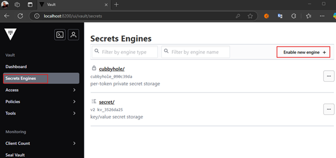
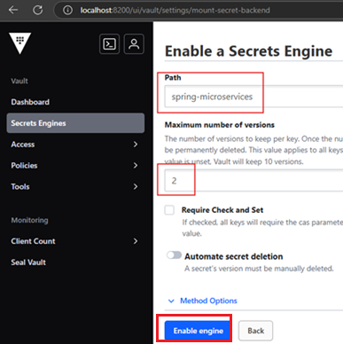
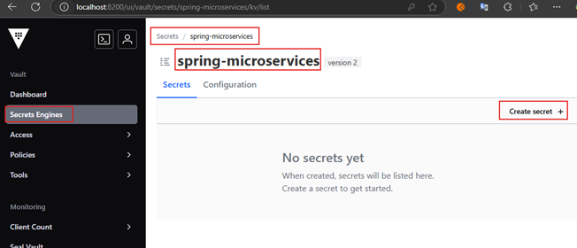
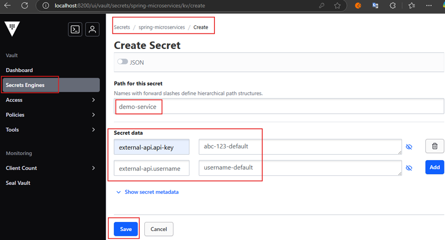
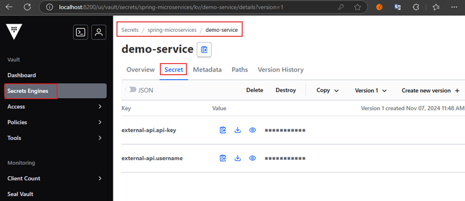
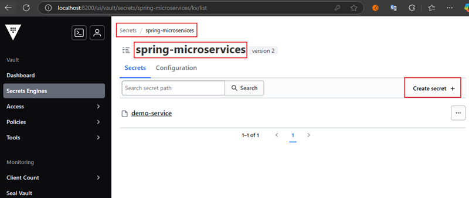
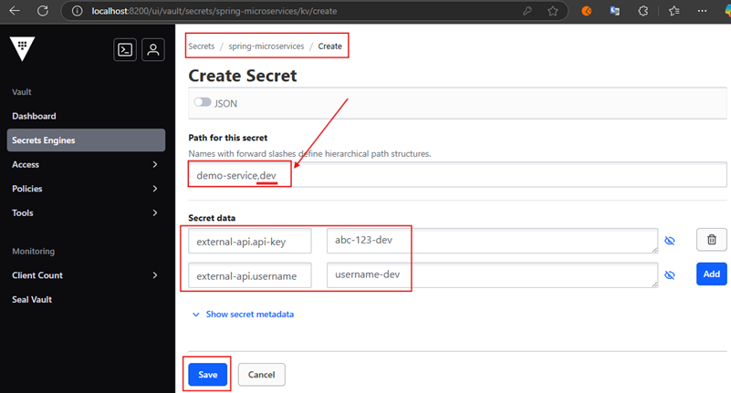
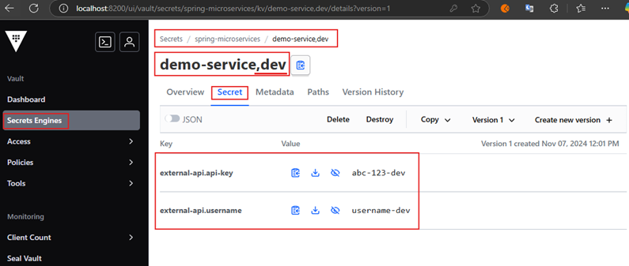
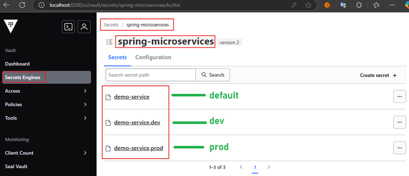

# Spring Boot App + Spring Cloud Config Server + Vault

Se tomó como referencia el tutorial desarrollado en este repositorio
[spring-microservices-in-action-2021](https://github.com/magadiflo/spring-microservices-in-action-2021/blob/main/05.configuration-with-spring-cloud-config-server.md)

---

# Vault Server

---

Iniciamos el servidor de `Vault` asignándole `root` como su token id.

````bash
C:\vault_1.18.1
$ vault server -dev -dev-root-token-id root

==> Vault server configuration:

Administrative Namespace:
             Api Address: http://127.0.0.1:8200
                     Cgo: disabled
         Cluster Address: https://127.0.0.1:8201
   Environment Variables: , , , , , , , ALLUSERSPROFILE, ANSICON, ANSICON_DEF, APPDATA, CLINK_COMPLETIONS_DIR, CMDER_ALIASES, CMDER_CLINK, CMDER_CONFIGURED, CMDER_CONFIG_DIR, CMDER_INIT_END, CMDER_INIT_START, CMDER_ROOT, CMDER_SHELL, CMDER_USER_FLAGS, COLUMNS, COMPUTERNAME, ChocolateyInstall, ChocolateyLastPathUpdate, ComSpec, CommonProgramFiles, CommonProgramFiles(x86), CommonProgramW6432, ConEmuANSI, ConEmuAnsiLog, ConEmuArgs, ConEmuArgs2, ConEmuBackHWND, ConEmuBaseDir, ConEmuBaseDirShort, ConEmuBuild, ConEmuCfgDir, ConEmuConfig, ConEmuDir, ConEmuDrawHWND, ConEmuDrive, ConEmuHWND, ConEmuHooks, ConEmuPID, ConEmuPalette, ConEmuServerPID, ConEmuTask, ConEmuWorkDir, ConEmuWorkDrive, DataGrip, DriverData, EFC_4500, ESC, FPS_BROWSER_APP_PROFILE_STRING, FPS_BROWSER_USER_PROFILE_STRING, GIT_INSTALL_ROOT, GIT_VERSION_USER, HOME, HOMEDRIVE, HOMEPATH, IntelliJ IDEA Community Edition, JAVA_HOME, LANG, LINES, LOCALAPPDATA, LOGONSERVER, MAVEN_HOME, NUMBER_OF_PROCESSORS, NVM_HOME, NVM_SYMLINK, OLD_PATH, OS, OneDrive, PASSWORD_MS_CONFIG_SERVER, PATHEXT, PLINK_PROTOCOL, POSH_INSTALLER, POSH_THEMES_PATH, PROCESSOR_ARCHITECTURE, PROCESSOR_IDENTIFIER, PROCESSOR_LEVEL, PROCESSOR_REVISION, PROMPT, PSModulePath, PUBLIC, Path, ProgramData, ProgramFiles, ProgramFiles(x86), ProgramW6432, SESSIONNAME, SVN_SSH, SystemDrive, SystemRoot, TEMP, TMP, USERDOMAIN, USERDOMAIN_ROAMINGPROFILE, USERNAME, USERPROFILE, USER_BUILD, USER_MAJOR, USER_MINOR, USER_PATCH, VAULT_ADDR, ZES_ENABLE_SYSMAN, add_path, add_to_path, aliases, architecture_bits, ccall, cexec, clink_architecture, clink_dummy_capture_env, currenArgu, debug_output, depth, fast_init, feFlagName, feNot, find_query, found, full_path, git_executable, git_locale, lib_base, lib_console, lib_git, lib_path, lib_profile, max_depth, nix_tools, path_position, position, print_debug, print_error, print_verbose, print_warning, time_init, user_aliases, verbose_output, windir
              Go Version: go1.22.8
              Listener 1: tcp (addr: "127.0.0.1:8200", cluster address: "127.0.0.1:8201", disable_request_limiter: "false", max_request_duration: "1m30s", max_request_size: "33554432", tls: "disabled")
               Log Level:
                   Mlock: supported: false, enabled: false
           Recovery Mode: false
                 Storage: inmem
                 Version: Vault v1.18.1, built 2024-10-29T14:21:31Z
             Version Sha: f479e5c85462477c9334564bc8f69531cdb03b65

==> Vault server started! Log data will stream in below:

2024-11-07T11:34:43.257-0500 [INFO]  proxy environment: http_proxy="" https_proxy="" no_proxy=""
...
and starts unsealed with a single unseal key. The root token is already
authenticated to the CLI, so you can immediately begin using Vault.

You may need to set the following environment variables:

PowerShell:
    $env:VAULT_ADDR="http://127.0.0.1:8200"
cmd.exe:
    set VAULT_ADDR=http://127.0.0.1:8200

The unseal key and root token are displayed below in case you want to
seal/unseal the Vault or re-authenticate.

Unseal Key: j1Qvvw4JZVVtAc1RXEhd19uZILP0KEPF/a6+Dag11Dc=
Root Token: root

Development mode should NOT be used in production installations!
````

Ahora nos vamos a la dirección de `Vault` `http://localhost:8200`, nos autenticamos con el método `token` y usamos
`root` para iniciar sesión. Recordemos que `root` es el valor que le definimos al `-dev-root-token-id` cuando iniciamos
el servidor.

En el siguiente dashboard, vamos a la opción de `Secrets Engines` y damos click en `Enable new engine` para habilitar un
nuevo motor de secretos.



Nos aparecerá una nueva pantalla con varias opciones, de las cuales en la sección `Generic` seleccionaremos `KV`. Luego
nos aparecerá la siguiente pantalla donde completamos con los siguientes datos.



- `Path: spring-microservices`, define el nombre del motor de secretos en Vault donde `Spring Cloud Config Server`
  obtendrá las configuraciones.
- `Maximum number of versions: 2`, definimos que como máximo solo guarde 2 versiones de los secretos.

Luego de dar en el botón `Enable engine` nos aparecerá la siguiente pantalla donde daremos clic en `Create secret +`
para empezar a crear los secretos.



## Perfil default: Creando secretos para demo-service

En la siguiente pantalla crearemos los secretos para el microservicio `demo-service`, estas propiedades de configuración
serán las propiedades del perfil por `default` para este microservicio.



- `Path for this secret: demo-service`, aquí definimos el nombre del microservicio que se conecta a
  `Spring Cloud Config Server` para recuperar las configuraciones del perfil por defecto. El microservicio
  `demo-service` será construído más adelante.

Luego de dar en el botón `Save` nos mostrará la siguiente pantalla. Seleccionamos la pestaña `Secret` donde observamos
nuestras configuraciones.



## Perfil dev: Creando secretos para demo-service

Tenga en cuenta que almacenar un secreto usando la sintaxis `spring-microservices/demo-service,dev` nos permite
almacenar una propiedad específica del perfil `dev` del servicio `demo-service`.

> Recordar que más adelante crearemos un microservicio al cual le llamaremos `demo-service`, es decir, la configuración
> `spring.application.name=demo-service` estará definida en ese microservicio y todas estas configuraciones lo estamos
> haciendo para ese microservicio que se conectará a `Spring Cloud Config Server` y este a su vez tomará las propiedades
> desde `Vault`.

En consecuencia, podemos crear secretos en `Vault` para el perfil `dev` de nuestro microservicio `demo-service`.
Esto lo hacemos de la siguiente manera.

Posicionados en nuestro motor de secretos `spring-microservices` vamos a la opción de `Create secret +`.



En la siguiente pantalla vamos a crear el perfil usando el `<nombre_del_microservicio>,<perfil>` y a continuación
agregar las configuraciones propias de este perfil que en nuestro caso serán las mismas que definimos en el perfil por
`default` pero los valores sí serán propios del perfil `dev`.



Luego de dar clic en el botón `Save` nos muestra la siguiente pantalla donde seleccionamos la pestaña `Secret` y
veremos las configuraciones creadas para nuestro perfil `dev`.



## Perfil prod: Creando secretos para demo-service

De la misma manera que creamos las configuraciones para el perfil `dev`, haremos lo mismo para el perfil `prod`. En la
siguiente imagen observamos dichas configuraciones y en especial observemos cómo es que estamos creando este perfil
`demo-service,prod`.


Finalmente, si nos posicionamos en la raíz de nuestro motor de secretos `spring-microservices` veremos los tres perfiles
creados para el microservicio `demo-service`: `default`, `dev`, `prod`.



---

# Spring Cloud Config Server

---

## Dependencias

````xml
<!--Spring Boot 3.3.5-->
<!--Java 21-->
<!--Spring Cloud Version 2023.0.3-->
<dependencies>
    <dependency>
        <groupId>org.springframework.cloud</groupId>
        <artifactId>spring-cloud-config-server</artifactId>
    </dependency>

    <dependency>
        <groupId>org.springframework.boot</groupId>
        <artifactId>spring-boot-starter-test</artifactId>
        <scope>test</scope>
    </dependency>
</dependencies>
````

## Configuraciones iniciales

A continuación se muestran las configuraciones de nuestro `config-server`, estas incluyen configuraciones para poder
comunicarnos con `Vault`.

````yml
server:
  port: 8888
  error:
    include-message: always

spring:
  application:
    name: config-server
  profiles:
    active: vault

  cloud:
    config:
      server:
        vault:
          host: localhost
          port: 8200
          kvVersion: 2
          backend: spring-microservices
````

- Observemos que estamos activando el perfil `vault` en nuestro `config-server` y a continuación definiendo las
  configuraciones para conectanos a `Vault`.

- La configuración `kvVersion`, establece la versión del motor de secretos `kv`. Se recomienda utilizar
  `kvVersion de 2`.

- Con respecto al `backend: spring-microservices`, se refiere al camino o `mount path` del motor de secretos dentro de
  `HashiCorp Vault` desde donde `Spring Cloud Config Server` obtendrá la configuración. Es decir, este es el nombre que
  le dimos al motor de secretos `KV (Secrets Engine)` cuando lo montamos en `Vault`.

**NOTA**
> Un punto importante aquí es la versión del motor kv secrets. El valor predeterminado para
> `spring.cloud.config.server.kv-version` es `1`. Pero se recomienda usar la `versión 2` cuando usamos `Vault 0.10.0` o
> posterior.

## Configura aplicación como servidor de configuraciones

Para habilitar nuestro `config-server` como un servidor de configuraciones debemos agregar la anotación
`@EnableConfigServer` en la clase principal de la aplicación.

````java

@EnableConfigServer
@SpringBootApplication
public class ConfigServerApplication {

    public static void main(String[] args) {
        SpringApplication.run(ConfigServerApplication.class, args);
    }

}
````

## Probando perfiles para el microservicio demo-service

Antes de empezar con la creación del microservicio `demo-service` podemos probar los perfiles que le creamos en `Vault`
a través del servidor de configuraciones. Entonces, podemos probar nuestro servidor de configuración mediante una
solicitud HTTP. Aquí puedes usar un comando `cURL` o algún cliente REST como `Postman`.

Empecemos enviando la siguiente petición.

````bash
$ curl -v  http://localhost:8888/demo-service/default | jq
>
* Request completely sent off
< HTTP/1.1 400
< Content-Type: application/json
< Transfer-Encoding: chunked
< Date: Thu, 07 Nov 2024 19:39:27 GMT
< Connection: close
<
{
  "timestamp": "2024-11-07T19:39:27.536+00:00",
  "status": 400,
  "error": "Bad Request",
  "message": "Missing required header in HttpServletRequest: X-Config-Token",
  "path": "/demo-service/default"
}
````

Este error indica que el servidor de configuración de `Spring Cloud Config` está esperando el encabezado
`X-Config-Token` en la solicitud HTTP para autenticar el acceso a `Vault`, pero la solicitud curl que realizamos no lo
incluyó.

Entonces, es importante enviar la cabecera `X-Config-Token` con el valor `root` en la petición para que nuestro
servidor de configuraciones autentique correctamente el acceso a `Vault`.

En la siguiente petición vemos los valores obtenidos para el perfil por defecto de nuestro microservicio `demo-service`.

````bash
$ curl -v -H "X-Config-Token: root" http://localhost:8888/demo-service/default | jq
>
< HTTP/1.1 200
< Content-Type: application/json
< Transfer-Encoding: chunked
< Date: Thu, 07 Nov 2024 18:03:48 GMT
<
{
  "name": "demo-service",
  "profiles": [
    "default"
  ],
  "label": null,
  "version": null,
  "state": null,
  "propertySources": [
    {
      "name": "vault:demo-service",
      "source": {
        "external-api.api-key": "abc-123-default",
        "external-api.username": "username-default"
      }
    }
  ]
}
````

En la siguiente petición vemos los valores obtenidos para el perfil `dev` del microservicio `demo-service`. Es
importante observar que a pesar de que solicitamos el perfil `dev`, el perfil por `default` también se está cargando y
si alguna propiedad no está definida en el perfil `dev`, se tomará el del perfil por `default` si es que allí se
encuentra definido.

````bash
$ curl -v -H "X-Config-Token: root" http://localhost:8888/demo-service/dev | jq
>
< HTTP/1.1 200
< Content-Type: application/json
< Transfer-Encoding: chunked
< Date: Thu, 07 Nov 2024 18:04:35 GMT
<
{
  "name": "demo-service",
  "profiles": [
    "dev"
  ],
  "label": null,
  "version": null,
  "state": null,
  "propertySources": [
    {
      "name": "vault:demo-service,dev",
      "source": {
        "external-api.api-key": "abc-123-dev",
        "external-api.username": "username-dev"
      }
    },
    {
      "name": "vault:demo-service",
      "source": {
        "external-api.api-key": "abc-123-default",
        "external-api.username": "username-default"
      }
    }
  ]
}
````

En la siguiente petición solicitamos las configuraciones para el perfil `prod` del microservicio `demo-service`.

````bash
$ curl -v -H "X-Config-Token: root" http://localhost:8888/demo-service/prod | jq
>
< HTTP/1.1 200
< Content-Type: application/json
< Transfer-Encoding: chunked
< Date: Thu, 07 Nov 2024 18:04:53 GMT
<
{
  "name": "demo-service",
  "profiles": [
    "prod"
  ],
  "label": null,
  "version": null,
  "state": null,
  "propertySources": [
    {
      "name": "vault:demo-service,prod",
      "source": {
        "external-api.api-key": "abc-123-prod",
        "external-api.username": "username-prod"
      }
    },
    {
      "name": "vault:demo-service",
      "source": {
        "external-api.api-key": "abc-123-default",
        "external-api.username": "username-default"
      }
    }
  ]
}
````
