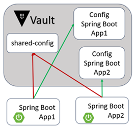
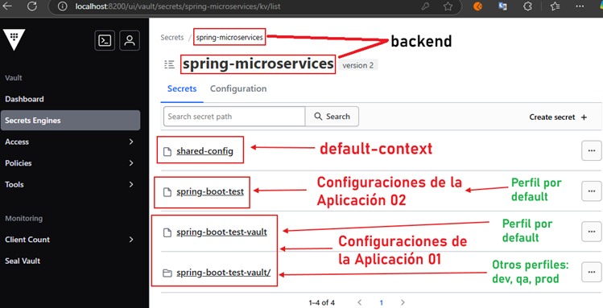
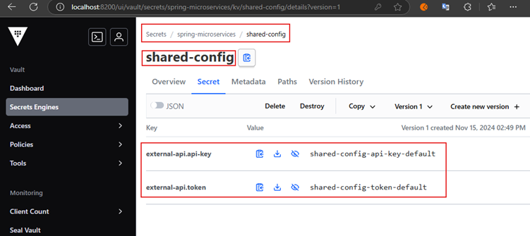
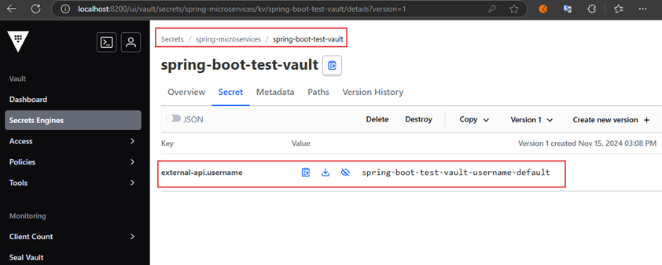
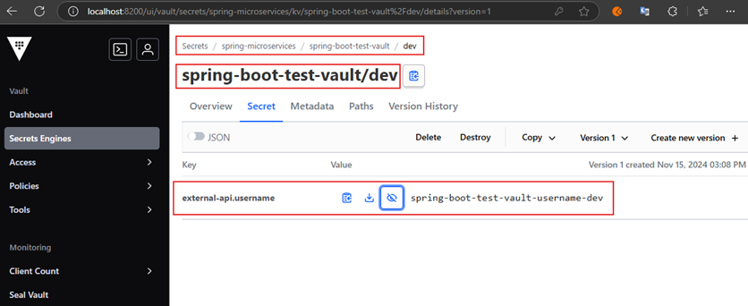
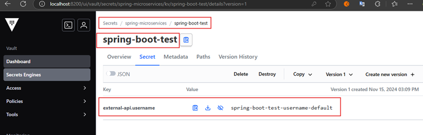

# Configuraciones específicas y compartidas en Vault

---

## Contexto



En ejemplos anteriores nos conectamos desde nuestra aplicación de `Spring Boot` hacia `Vault` y obteníamos las
configuraciones de la aplicación en función a su perfil, si es que definíamos algún perfil determinado en el
`spring.profiles.active`.

**¿Qué sucede si es que tenemos varias aplicaciones que también obtienen sus configuraciones desde `vault`, pero que al
mismo tiempo tienen configuraciones similares?** No sería práctico repetir las configuraciones en `vault` para las
aplicaciones que comparten las mismas configuraciones, dado que más adelante esas configuraciones pueden cambiar, y al
hacerlo, se tendría que ir a cambiar en todos los lugares que tienen esa configuración.

Entonces, lo que debemos hacer es compartir el mismo `default-context` con todas las aplicaciones que comparten la misma
configuración y definir el `application-name` para las configuraciones específicas de cada aplicación.

## Configura Vault con configuraciones compartidas y específicas

Vamos a seguir los mismos pasos que hicimos para configurar el `Vault` del `spring-boot-vault`, la única diferencia es
que aquí crearemos un `default-context` al que le llamaremos `shared-config`.



Dentro del `shared-config` colocamos todas las configuraciones que son comunes o que son compartidas por todas las
aplicaciones. En la siguiente imagen he dos configuraciones cuyo valor será el mismo para las dos aplicaciones que
crearé más adelante.



La primera aplicación llamada `spring-boot-test-vault` tendrá como configuración en su perfil por `default` el siguiente
valor.



La misma aplicación tendrá como configuración en su perfil `dev` el siguiente valor.



La segunda aplicación que crearemos ser llamará `spring-boot-test` y únicamente tendrá el perfil `default` cuyas
configuraciones se muestran a continuación.



## Aplicación 01: spring-boot-test-vault

La primera aplicación se llamará `spring-boot-test-vault` y tendrá las mismas configuraciones en su `application.yml`
que vimos en la aplicación de `spring-boot-vault` con la pequeña diferencia de que aquí se usa el `application-name`.

````yml
spring:
  application:
    name: spring-boot-test-vault
  profiles:
    active: dev

  cloud:
    vault:
      host: localhost
      port: 8200
      token: root
      scheme: http
      kv:
        backend: spring-microservices
        default-context: shared-config                  # Contexto común
        application-name: ${spring.application.name}    # Configuración específica

  config:
    import: optional:vault://

external-api:
  uri: https://external-api-for-spring-boot-test-vault.com/v1/
````

- `kv.backend`, especifica que estás utilizando el backend de `KV (Key-Value)` llamado `spring-microservices`. Aquí es
  donde `Vault` buscará las configuraciones.
- `default-context`, representa un contexto base o compartido que se busca para todas las aplicaciones. Es útil para
  centralizar configuraciones comunes que varias aplicaciones comparten. Por ejemplo, puedes usarlo para almacenar
  credenciales de una base de datos que todas las aplicaciones utilizan.
- `application-name`, representa un contexto específico para cada aplicación individual. Este valor suele derivarse
  automáticamente del nombre de la aplicación definido en `spring.application.name`.

Cuando configuras tanto `default-context` como `application-name`, `Spring Boot` busca las propiedades en el siguiente
orden de prioridad:

1. `Propiedades específicas de la aplicación`: Las configuraciones en el contexto definido por `application-name` (por
   ejemplo, `spring-boot-test-vault`) tienen la mayor prioridad.
2. `Propiedades comunes`: Si no encuentra una propiedad en el contexto específico, buscará en el `default-context` (por
   ejemplo, `shared-config`).

Esto permite combinar configuraciones específicas y compartidas de manera jerárquica. Si un valor está definido en ambos
contextos, la configuración específica de la aplicación tiene prioridad. Esto te permite sobrescribir valores
específicos sin perder la configuración común.

Con este enfoque, las credenciales de la base de datos (y cualquier otra configuración compartida) estarán centralizadas
en el contexto `shared-config`. Si necesitas actualizar las credenciales, solo haces el cambio en un solo lugar (en
`Vault`, bajo `shared-config`).

## Aplicación 02: spring-boot-test

Esta segunda aplicación se llamará `spring-boot-test` y tendrá las siguientes configuraciones en su `application.yml`.

````yml
server:
  port: 8081
  error:
    include-message: always

spring:
  application:
    name: spring-boot-test

  cloud:
    vault:
      host: localhost
      port: 8200
      token: root
      scheme: http
      kv:
        backend: spring-microservices
        default-context: shared-config                    # Contexto común
        application-name: ${spring.application.name}      # Configuración específica

  config:
    import: optional:vault://
````

Notar que estamos usando el mismo backend `spring-microservices` y por supuesto el mismo `default-context` ya que esta
aplicación usa los mismos valores definidos en las configuraciones dentro de ese contexto. Por otro lado, esta
aplicación cuenta con sus propias configuraciones que están definidas en el `application-name`.

## Mapea configuraciones a una clase de propiedades

Las dos aplicaciones que hemos construído tendrán la siguiente clase que permitirá mapear sus configuraciones.

````java

@Setter
@Getter
@ConfigurationProperties(prefix = "external-api")
public class ExternalApiConfig {
    private String apiKey;
    private String token;
    private String username;

    private String dbPassword;
    private String dbUser;

    private String uri; // Obtenida del application.yml
}
````

Además, en la clase principal de cada aplicación implementaremos la interfaz `CommandLineRunner` donde sobreescribiremos
su método `run()`. En ese método estaremos imprimiendo las distintas propiedades de la clase anterior.

````java

@Override
public void run(String... args) throws Exception {
    log.info("----------------------------------------");
    log.info("Configuration properties");
    log.info("   external-api.api-key: {}", configuration.getApiKey());
    log.info("   external-api.token: {}", configuration.getToken());
    log.info("   external-api.username: {}", configuration.getUsername());
    log.info("   external-api.db-password: {}", configuration.getDbPassword());
    log.info("   external-api.db-user: {}", configuration.getDbUser());
    log.info("   external-api.uri: {}", configuration.getUri());
    log.info("----------------------------------------");
}
````

## Ejecutando Aplicación 01: spring-boot-test-vault

Ejecutamos nuestra aplicación `spring-boot-test-vault` con su perfil `default`.

````bash
INFO 8056 --- [spring-boot-test-vault] [           main] d.m.app.SpringBootTestVaultApplication   : No active profile set, falling back to 1 default profile: "default"
...
INFO 8056 --- [spring-boot-test-vault] [           main] d.m.app.SpringBootTestVaultApplication   : ----------------------------------------
INFO 8056 --- [spring-boot-test-vault] [           main] d.m.app.SpringBootTestVaultApplication   : Configuration properties
INFO 8056 --- [spring-boot-test-vault] [           main] d.m.app.SpringBootTestVaultApplication   :    external-api.api-key: shared-config-api-key-default
INFO 8056 --- [spring-boot-test-vault] [           main] d.m.app.SpringBootTestVaultApplication   :    external-api.token: shared-config-token-default
INFO 8056 --- [spring-boot-test-vault] [           main] d.m.app.SpringBootTestVaultApplication   :    external-api.username: spring-boot-test-vault-username-default
INFO 8056 --- [spring-boot-test-vault] [           main] d.m.app.SpringBootTestVaultApplication   :    external-api.db-password: null
INFO 8056 --- [spring-boot-test-vault] [           main] d.m.app.SpringBootTestVaultApplication   :    external-api.db-user: null
INFO 8056 --- [spring-boot-test-vault] [           main] d.m.app.SpringBootTestVaultApplication   :    external-api.uri: https://external-api-for-spring-boot-test-vault.com/v1/
INFO 8056 --- [spring-boot-test-vault] [           main] d.m.app.SpringBootTestVaultApplication   : ----------------------------------------
````

Ejecutamos nuestra aplicación `spring-boot-test-vault` con su perfil `dev`.

````bash
INFO 10112 --- [spring-boot-test-vault] [           main] d.m.app.SpringBootTestVaultApplication   : The following 1 profile is active: "dev"
...
INFO 10112 --- [spring-boot-test-vault] [           main] d.m.app.SpringBootTestVaultApplication   : ----------------------------------------
INFO 10112 --- [spring-boot-test-vault] [           main] d.m.app.SpringBootTestVaultApplication   : Configuration properties
INFO 10112 --- [spring-boot-test-vault] [           main] d.m.app.SpringBootTestVaultApplication   :    external-api.api-key: shared-config-api-key-default
INFO 10112 --- [spring-boot-test-vault] [           main] d.m.app.SpringBootTestVaultApplication   :    external-api.token: shared-config-token-default
INFO 10112 --- [spring-boot-test-vault] [           main] d.m.app.SpringBootTestVaultApplication   :    external-api.username: spring-boot-test-vault-username-dev
INFO 10112 --- [spring-boot-test-vault] [           main] d.m.app.SpringBootTestVaultApplication   :    external-api.db-password: null
INFO 10112 --- [spring-boot-test-vault] [           main] d.m.app.SpringBootTestVaultApplication   :    external-api.db-user: null
INFO 10112 --- [spring-boot-test-vault] [           main] d.m.app.SpringBootTestVaultApplication   :    external-api.uri: https://external-api-for-spring-boot-test-vault.com/v1/
INFO 10112 --- [spring-boot-test-vault] [           main] d.m.app.SpringBootTestVaultApplication   : ----------------------------------------
````

## Ejecutando Aplicación 02: spring-boot-test

Ejecutamos la segunda aplicación `spring-boot-test` con su perfil `default`.

````bash
INFO 8036 --- [spring-boot-test] [           main] d.m.app.SpringBootTestApplication        : No active profile set, falling back to 1 default profile: "default"
...
INFO 8036 --- [spring-boot-test] [           main] d.m.app.SpringBootTestApplication        : ----------------------------------------
INFO 8036 --- [spring-boot-test] [           main] d.m.app.SpringBootTestApplication        : Configuration properties
INFO 8036 --- [spring-boot-test] [           main] d.m.app.SpringBootTestApplication        :    external-api.api-key: shared-config-api-key-default
INFO 8036 --- [spring-boot-test] [           main] d.m.app.SpringBootTestApplication        :    external-api.token: shared-config-token-default
INFO 8036 --- [spring-boot-test] [           main] d.m.app.SpringBootTestApplication        :    external-api.username: spring-boot-test-username-default
INFO 8036 --- [spring-boot-test] [           main] d.m.app.SpringBootTestApplication        :    external-api.db-password: null
INFO 8036 --- [spring-boot-test] [           main] d.m.app.SpringBootTestApplication        :    external-api.db-user: null
INFO 8036 --- [spring-boot-test] [           main] d.m.app.SpringBootTestApplication        : ----------------------------------------
````

## Conclusión

Gracias al `default-context` a quien le llamamos `shared-config` pudimos definir configuraciones compartidas. Mientras
que en la configuración `application-name` definimos configuraciones propias del microservicio.