# [Spring Boot HashiCorp Vault Integration](https://medium.com/@namant744/spring-boot-hashicorp-vault-integration-265a344db9e1)

---

## ¿Qué es HasiCorp Vault?

`HashiCorp Vault` es un sistema de gestión de cifrado y secretos basado en identidad. Un secreto es cualquier cosa a la
que desee controlar estrictamente el acceso, como claves de cifrado de API, contraseñas y certificados. Vault
proporciona servicios de cifrado que están protegidos por métodos de autenticación y autorización.

## Instalación de Vault

Descargamos el ejecutable de la siguiente dirección
[Install Vault - windows](https://developer.hashicorp.com/vault/install#windows) y lo colocamos en el disco `C:/` en un
directorio con la versión descargada, en mi caso será `C:\vault_1.18.1`.

Si listamos el directorio veremos que ya tenemos nuestro `vault.exe` en el directorio.

```bash
C:\vault_1.18.1
$ ls
vault.exe*
```

## Configura variables de entorno

Realizar las siguientes configuraciones nos va a permitir usar la línea de comando para interactuar con `Vault`.

- Agregar el directorio `C:\vault_1.18.1` en el `Path` del `System variables` de nuestro S.O.. Damos en editar y
  agregamos la ruta.
- Agregar la variable `VAULT_ADDR` al `System variables` de nuestro S.O. con el valor `http://127.0.0.1:8200`. Damos en
  `New...` y creamos la nueva variable.

Una vez que configure la variable de entorno, estará listo. Para verificar, si lo ha hecho correctamente, abra
`cmd/terminal` según su sistema operativo para verificar.

````bash
M:\PERSONAL\PROGRAMACION\DESARROLLO_JAVA_SPRING\02.youtube\17.java_tech_solutions\spring-boot-vault (main)
$ vault version
Vault v1.18.1 (f479e5c85462477c9334564bc8f69531cdb03b65), built 2024-10-29T14:21:31Z
````

**Nota**
> Estas variables de entorno son necesarias si vamos a trabajar con la línea de comandos de `Vault`. Por ejemplo, si
> enviamos configuraciones mediante la línea de comandos a Voult de la siguiente manera.
>
> `vault kv put secret/spring-demo demo.token-app=123456-123456-123456`

## Iniciar y configurar servidor Vault local

Antes de saltar a la aplicación de Spring Boot, primero vamos a configurar nuestro servidor de `Vault` local ejecutando
el siguiente comando.

````bash
C:\vault_1.18.1
$ vault server -dev -dev-root-token-id root

==> Vault server configuration:

Administrative Namespace:
             Api Address: http://127.0.0.1:8200
                     Cgo: disabled
         Cluster Address: https://127.0.0.1:8201
   Environment Variables: , , , , , , ALLUSERSPROFILE, ANSICON, ANSICON_DEF, APPDATA, CLINK_COMPLETIONS_DIR, CMDER_ALIASES, CMDER_CLINK, CMDER_CONFIGURED, CMDER_CONFIG_DIR, CMDER_INIT_END, CMDER_INIT_START, CMDER_ROOT, CMDER_SHELL, CMDER_USER_FLAGS, COLUMNS, COMPUTERNAME, ChocolateyInstall, ChocolateyLastPathUpdate, ComSpec, CommonProgramFiles, CommonProgramFiles(x86), CommonProgramW6432, ConEmuANSI, ConEmuAnsiLog, ConEmuArgs, ConEmuArgs2, ConEmuBackHWND, ConEmuBaseDir, ConEmuBaseDirShort, ConEmuBuild, ConEmuCfgDir, ConEmuConfig, ConEmuDir, ConEmuDrawHWND, ConEmuDrive, ConEmuHWND, ConEmuHooks, ConEmuPID, ConEmuPalette, ConEmuServerPID, ConEmuTask, ConEmuWorkDir, ConEmuWorkDrive, DataGrip, DriverData, EFC_10264, ESC, GIT_INSTALL_ROOT, GIT_VERSION_USER, HOME, HOMEDRIVE, HOMEPATH, IntelliJ IDEA Community Edition, JAVA_HOME, LANG, LINES, LOCALAPPDATA, LOGONSERVER, MAVEN_HOME, NUMBER_OF_PROCESSORS, NVM_HOME, NVM_SYMLINK, OLD_PATH, OS, OneDrive, PASSWORD_MS_CONFIG_SERVER, PATHEXT, PLINK_PROTOCOL, POSH_INSTALLER, POSH_THEMES_PATH, PROCESSOR_ARCHITECTURE, PROCESSOR_IDENTIFIER, PROCESSOR_LEVEL, PROCESSOR_REVISION, PROMPT, PSModulePath, PUBLIC, Path, ProgramData, ProgramFiles, ProgramFiles(x86), ProgramW6432, SESSIONNAME, SVN_SSH, SystemDrive, SystemRoot, TEMP, TMP, USERDOMAIN, USERDOMAIN_ROAMINGPROFILE, USERNAME, USERPROFILE, USER_BUILD, USER_MAJOR, USER_MINOR, USER_PATCH, VAULT_ADDR, ZES_ENABLE_SYSMAN, add_path, add_to_path, aliases, architecture_bits, ccall, cexec, clink_architecture, clink_dummy_capture_env, currenArgu, debug_output, depth, fast_init, feFlagName, feNot, find_query, found, full_path, git_executable, git_locale, lib_base, lib_console, lib_git, lib_path, lib_profile, max_depth, nix_tools, path_position, position, print_debug, print_error, print_verbose, print_warning, time_init, user_aliases, verbose_output, windir
              Go Version: go1.22.8
              Listener 1: tcp (addr: "127.0.0.1:8200", cluster address: "127.0.0.1:8201", disable_request_limiter: "false", max_request_duration: "1m30s", max_request_size: "33554432", tls: "disabled")
               Log Level:
                   Mlock: supported: false, enabled: false
           Recovery Mode: false
                 Storage: inmem
                 Version: Vault v1.18.1, built 2024-10-29T14:21:31Z
             Version Sha: f479e5c85462477c9334564bc8f69531cdb03b65

==> Vault server started! Log data will stream in below:

2024-11-06T16:42:33.814-0500 [INFO]  proxy environment: http_proxy="" https_proxy="" no_proxy=""
...
WARNING! dev mode is enabled! In this mode, Vault runs entirely in-memory
and starts unsealed with a single unseal key. The root token is already
authenticated to the CLI, so you can immediately begin using Vault.

You may need to set the following environment variables:

PowerShell:
    $env:VAULT_ADDR="http://127.0.0.1:8200"
cmd.exe:
    set VAULT_ADDR=http://127.0.0.1:8200

The unseal key and root token are displayed below in case you want to
seal/unseal the Vault or re-authenticate.

Unseal Key: EXNLql3L7t6YXOvRAvgS1GGqJn8UmExqFLDqq0QZM7w=
Root Token: root

Development mode should NOT be used in production installations!
````

En el comando anterior, hemos especificado el parámetro `-dev-root-token-id` con el valor de `root`, pero si no lo
especificamos, `Vault` generará un token aleatorio para nosotros.

Es hora de abrir el navegador y acceder a http://localhost:8200 que abrirá la interfaz de usuario de la instancia
del servidor de `Vault` que se ejecuta en `localhost`.

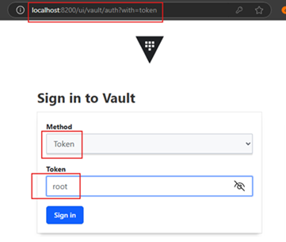

Para iniciar sesión, use el mismo token `(root)` que hemos usado para ejecutar el servidor de `Vault`. Una vez que
haya iniciado sesión, verá el tablero como se muestra en la captura de pantalla a continuación.

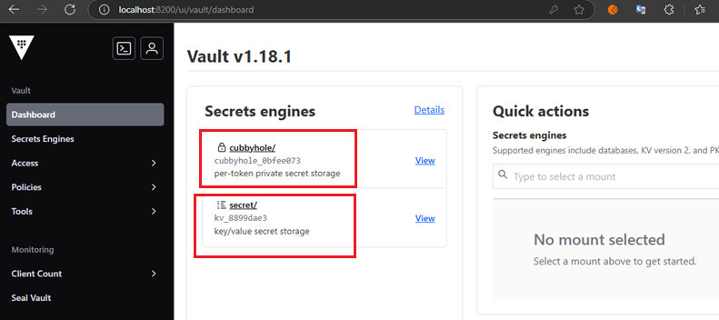

Debería ver dos motores secretos de forma predeterminada `(cubbyhole y secret)`. No usaremos el predeterminado, sino
más bien crearemos o habilitaremos un nuevo motor secreto. Para eso, seguiremos los pasos que a continuación se indican.

1. Click on `Enable new engine`.

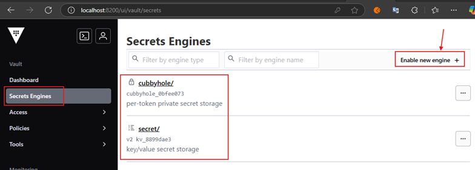

2. Seleccione la primera opción `KV` en la sección `Generic` y haga clic en siguiente

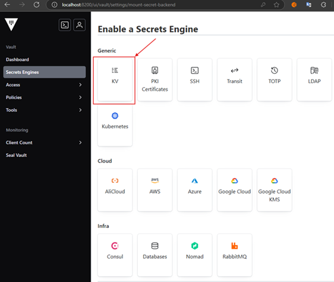

3. En la siguiente ventana agregamos un `Path` que define el nombre del motor de secretos que vamos a crear
   `(spring-microservices)`. Este `Path` será el que nuestra aplicación de `Spring Boot` usará para buscar las
   configuraciones. Con respecto al número máximo de versiones donde definiremos `2`, se refiere al número de versiones
   que se conservarán por clave. Una vez que el número de claves supere el número máximo establecido aquí, se eliminará
   permanentemente la versión más antigua. Este valor se aplica a todas las claves, pero la configuración de metadatos
   de una clave puede sobrescribir este valor. Cuando se utiliza `0` o el valor no está establecido, `Vault` conservará
   10 versiones.

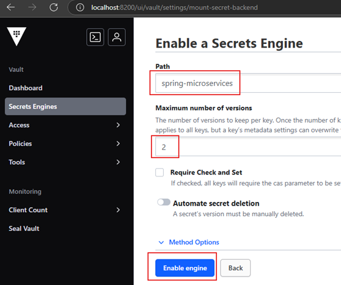

4. Ahora tenemos nuestro motor de secretos llamado `spring-microservices` donde pondremos todas las claves, secretos,
   contraseñas, etc.

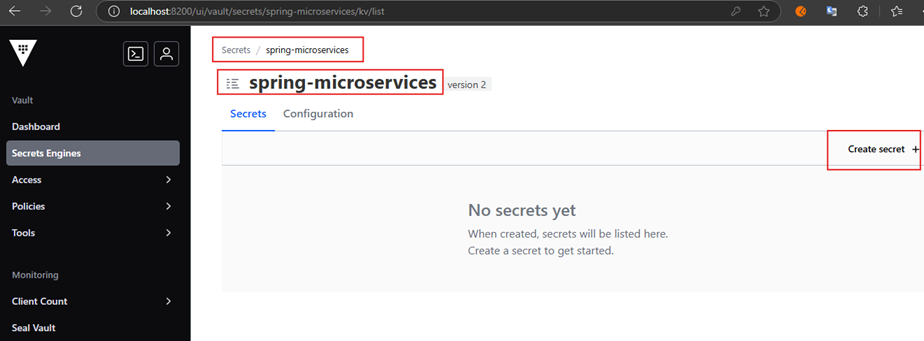

5. Para crear un secreto damos click en `Create secret +` de la imagen anterior. A continuación se nos abrirá la
   siguiente pantalla donde agregamos tres configuraciones.

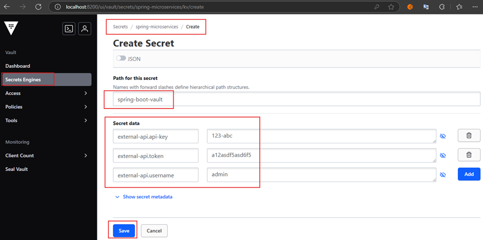

6. Luego de haber dado en `Save` seremos redireccionados a la siguiente pantalla. Nos vamos a la pestaña `Secret` y
   vemos que están nuestras configuraciones registradas correctamente.

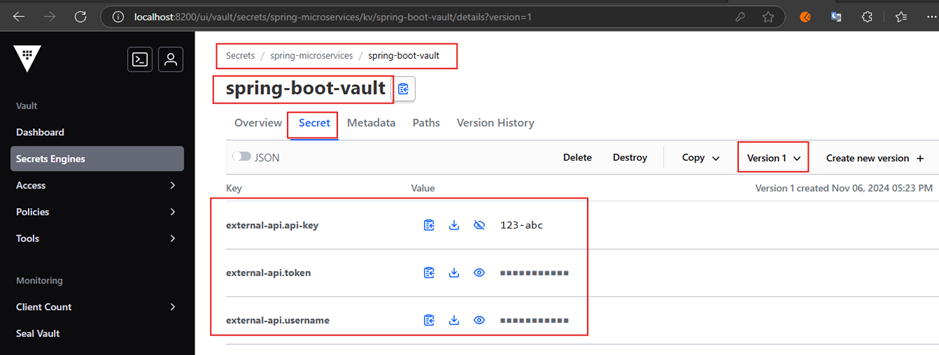

## Dependencias de nuestra aplicación de Spring Boot

Para esta demostración vamos a usar las siguientes dependencias.

````xml
<!--Spring Boot 3.3.5-->
<!--Java 21-->
<!--Spring Cloud Version 2023.0.3-->
<dependencies>
    <dependency>
        <groupId>org.springframework.boot</groupId>
        <artifactId>spring-boot-starter-web</artifactId>
    </dependency>
    <dependency>
        <groupId>org.springframework.cloud</groupId>
        <artifactId>spring-cloud-starter-vault-config</artifactId>
    </dependency>

    <dependency>
        <groupId>org.projectlombok</groupId>
        <artifactId>lombok</artifactId>
        <optional>true</optional>
    </dependency>
    <dependency>
        <groupId>org.springframework.boot</groupId>
        <artifactId>spring-boot-starter-test</artifactId>
        <scope>test</scope>
    </dependency>
</dependencies>
````

## Define propiedades de configuración

Configuramos nuestro `application.yml` con las siguientes propiedades.

````yml
spring:
  application:
    name: spring-boot-vault

  cloud:
    vault:
      host: localhost
      port: 8200
      token: root
      scheme: http
      kv:
        backend: spring-microservices
        default-context: spring-boot-vault

  config:
    import: optional:vault://

external-api:
  uri: https://external-api-for-spring-boot-vault.com/v1/
````

**Donde**

- `spring.application.name=spring-boot-vault`, le damos un nombre a nuestra aplicación.
- `spring.cloud.vault.host=localhost`, dado que la bóveda se está ejecutando en nuestro sistema local, podemos
  proporcionar el localhost como host.
- `spring.cloud.vault.port=8200`, por defecto el puerto del servidor de Vault es 8200.
- `spring.cloud.vault.token=root`, colocamos el mismo token que usamos para levantar el servidor de Vault.
- `spring.cloud.vault.scheme=http`, por defecto el scheme se establece en https, pero estamos ejecutando nuestro
  servidor de Vault en http.
- `spring.cloud.vault.kv.backend=spring-microservices`, definimos el nombre del motor de secretos que creamos en Vault.
  El backend por defecto es `secret`.
- `spring.cloud.vault.kv.default-context=spring-boot-vault`, en `Vault`, dentro del backend (motor de secreto
  `spring-microservices`) hemos almacenado nuestras propiedades de configuración en el path `spring-boot-vault`. En
  Spring Boot el path por defecto es establece como `application`, pero nosotros lo cambiamos a
  `spring-boot-vault` con esta configuración.

Hasta ahora hemos configurado casi todo para obtener las credenciales del servidor de `Vault`, pero es posible que
tenga la duda de que cómo spring sabrá desde dónde debe importar la configuración. Porque si ha definido una
clase de propiedades de configuración, siempre buscará en el archivo `application.yml`.

- `spring.config.import=vault://`, para importar la configuración desde el servidor de `Vault`, simplemente use la
  siguiente configuración.
- `external-api.uri=https://external-api-for-spring-boot-vault.com/v1/`, esta propiedad personalizada la definimos en el
  `application.yml` dado que consideramos que no es confidencial. Pero, de todas maneras la clase de confiuración que
  creemos más adelante, tendrá defnida esta propidad junto con las otras propiedades que se traen del servidor de Vault.

## Crea clase de configuración de propiedades

Creamos una clase de configuración que obtendrá las propiedades definidas en `Vault`. Es importante notar que
estamos usando como prefijo `external-api`, el mismo prefijo que le definimos a todas las configuraciones que
establecimos en `Vault`.

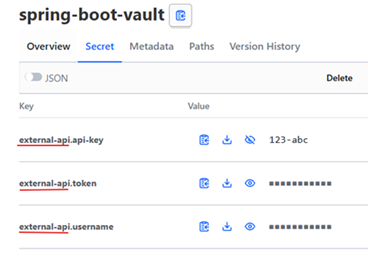

Por lo tanto, el `prefix = "external-api"` debe ser el mismo que definimos en `Vault`. En `Vault` definimos 3
propiedades de configuración `api-key`, `token` y el `username`, todos con el prefijo `external-api`.

Ahora, en nuestra clase estamos definiendo además, una propiedad adicional `uri`. El valor de esta propiedad estará
definida en el `application.yml` de nuestra aplicación `spring-boot-vault`, dado que asumiré que no es confidencial y
podemos almacenarlo en nuestro archivo de propiedades. Por lo tanto, las tres propiedades iniciales las obtendrá de
`Vault` y la última, el uri, la obtendrá del `application.yml`.

````java

@Setter
@Getter
@ConfigurationProperties(prefix = "external-api")
public class ExternalApiConfig {
    private String apiKey;
    private String token;
    private String username;
    private String uri; // Obtenida del application.yml
}
````

## Configura clase principal

Para verificar que nuestra aplicación se está comunicando con `Vault` y se están cargando correctamente las propiedades,
vamos a configurar la clase principal para ver el resultado.

````java

@Slf4j
@RequiredArgsConstructor
@EnableConfigurationProperties(ExternalApiConfig.class)
@SpringBootApplication
public class SpringBootVaultApplication implements CommandLineRunner {

    private final ExternalApiConfig configuration;

    public static void main(String[] args) {
        SpringApplication.run(SpringBootVaultApplication.class, args);
    }

    @Override
    public void run(String... args) throws Exception {
        log.info("----------------------------------------");
        log.info("Configuration properties");
        log.info("   external-api.api-key: {}", configuration.getApiKey());
        log.info("   external-api.token: {}", configuration.getToken());
        log.info("   external-api.username: {}", configuration.getUsername());
        log.info("   external-api.uri: {}", configuration.getUri());
        log.info("----------------------------------------");
    }
}
````

Ahora, ejecutamos la aplicación y veremos que en los resultados nos está trayendo los valores configurados en `Vault` y
además el valor definido en el `application.yml`.

````bash
  .   ____          _            __ _ _
 /\\ / ___'_ __ _ _(_)_ __  __ _ \ \ \ \
( ( )\___ | '_ | '_| | '_ \/ _` | \ \ \ \
 \\/  ___)| |_)| | | | | || (_| |  ) ) ) )
  '  |____| .__|_| |_|_| |_\__, | / / / /
 =========|_|==============|___/=/_/_/_/

 :: Spring Boot ::                (v3.3.5)

[spring-boot-vault] [           main] d.m.app.SpringBootVaultApplication       : Starting SpringBootVaultApplication using Java 21.0.1 with PID 16124 (M:\PERSONAL\PROGRAMACION\DESARROLLO_JAVA_SPRING\02.youtube\17.java_tech_solutions\spring-boot-vault\target\classes started by USUARIO in M:\PERSONAL\PROGRAMACION\DESARROLLO_JAVA_SPRING\02.youtube\17.java_tech_solutions\spring-boot-vault)
[spring-boot-vault] [           main] d.m.app.SpringBootVaultApplication       : No active profile set, falling back to 1 default profile: "default"
[spring-boot-vault] [           main] o.s.cloud.context.scope.GenericScope     : BeanFactory id=b1937e46-3c45-3fd7-8628-c62a19080c1b
[spring-boot-vault] [           main] o.s.b.w.embedded.tomcat.TomcatWebServer  : Tomcat initialized with port 8080 (http)
[spring-boot-vault] [           main] o.apache.catalina.core.StandardService   : Starting service [Tomcat]
[spring-boot-vault] [           main] o.apache.catalina.core.StandardEngine    : Starting Servlet engine: [Apache Tomcat/10.1.31]
[spring-boot-vault] [           main] o.a.c.c.C.[Tomcat].[localhost].[/]       : Initializing Spring embedded WebApplicationContext
[spring-boot-vault] [           main] w.s.c.ServletWebServerApplicationContext : Root WebApplicationContext: initialization completed in 2442 ms
[spring-boot-vault] [           main] o.s.b.w.embedded.tomcat.TomcatWebServer  : Tomcat started on port 8080 (http) with context path '/'
[spring-boot-vault] [           main] d.m.app.SpringBootVaultApplication       : Started SpringBootVaultApplication in 6.73 seconds (process running for 7.968)
[spring-boot-vault] [           main] d.m.app.SpringBootVaultApplication       : ----------------------------------------
[spring-boot-vault] [           main] d.m.app.SpringBootVaultApplication       : Configuration properties
[spring-boot-vault] [           main] d.m.app.SpringBootVaultApplication       :    external-api.api-key: 123-abc
[spring-boot-vault] [           main] d.m.app.SpringBootVaultApplication       :    external-api.token: a12asdf5asd6f5
[spring-boot-vault] [           main] d.m.app.SpringBootVaultApplication       :    external-api.username: admin
[spring-boot-vault] [           main] d.m.app.SpringBootVaultApplication       :    external-api.uri: https://external-api-for-spring-boot-vault.com/v1/
[spring-boot-vault] [           main] d.m.app.SpringBootVaultApplication       : ----------------------------------------
````

## Crea secretos según el perfil del microservicio

En este apartado vamos a crear perfiles para nuestra aplicación `spring-boot-vault`, así que nos posicionamos en el
motor de secretos (`spring-microservices`) que creamos anteriormente y damos clic en `Create secret`.

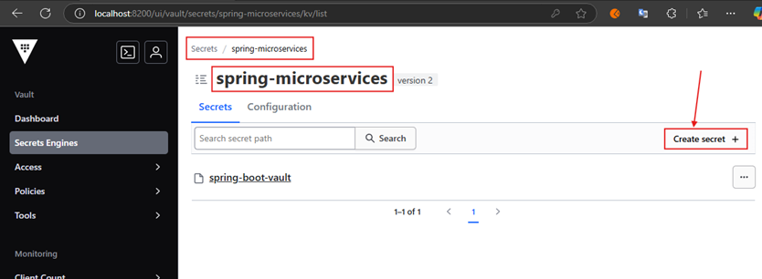

Aquí vamos a crear el perfil `dev` para nuestra aplicación `spring-boot-vault`, es por eso que en el `Path` lo
colocamos como `spring-boot-vault/dev`. Luego en el apartado de `Secret data` agregamos las propiedades con los valores
correspondientes para este perfil.

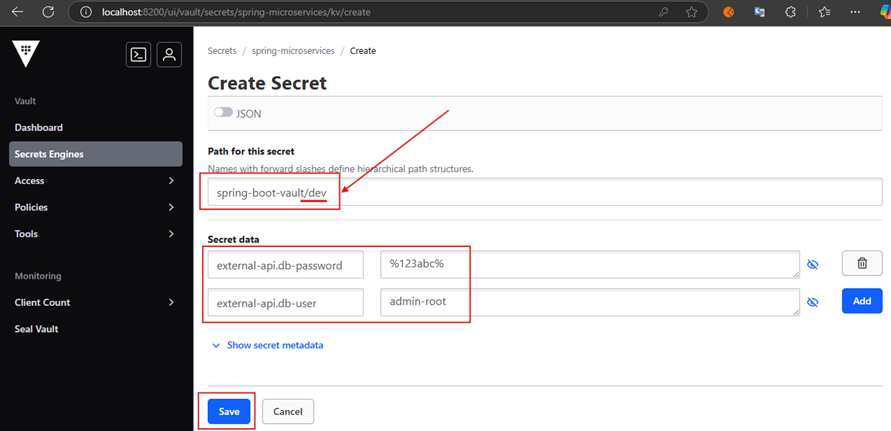

Luego de haber dado clic en `Save` seremos redireccionados a esta pantalla, en la pestaña `Secret` vemos nuestras
configuraciones realizadas.

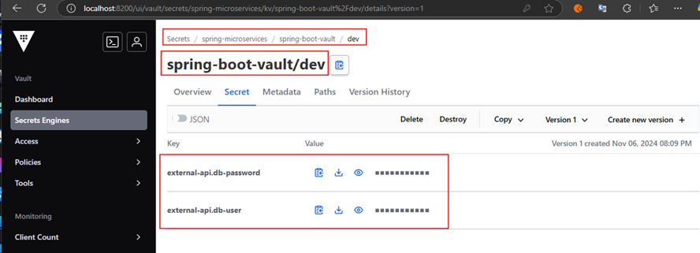

Si retrocedemos una vista atrás, veremos la siguiente pantalla. Digamos que dentro de `spring-boot-vault` tenemos
nuestro perfil `dev`.

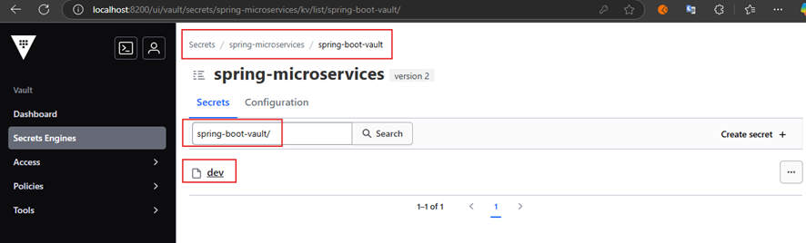

Ahora, si retrocedemos hasta posicionarnos en nuestro motor de secretos (`spring-microservices`) veremos los dos
paths creados hasta ahora. El primero `spring-boot-vault` es el que creamos al inicio de esta aplicación y que contiene
las tres configuraciones `api-key`, `token` y `username`, digamos que son las configuraciones por defecto.

Por otro lado, el path `spring-boot-vault/` contiene el perfil que creamos `dev` con las dos propiedades adicionales
`db-password` y `db-user`.

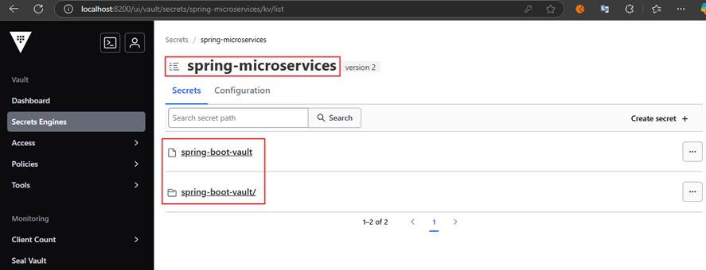

## Modificando aplicación de Spring Boot

Como hemos agregado el perfil `dev` que contiene dos atributos `db-password` y `db-user`, nuestra clase de configuración
también debe tener las propiedades que se mapearán a esas configuraciones.

````java

@Setter
@Getter
@ConfigurationProperties(prefix = "external-api")
public class ExternalApiConfig {
    private String apiKey;
    private String token;
    private String username;

    private String dbPassword;
    private String dbUser;

    private String uri; // Obtenida del application.yml
}
````

En la clase principal estamos mostrando los valores de las configuraciones, así que necesitamos agregar estas dos
propiedades adicionales agregadas en la clase anterior.

````java

@Slf4j
@RequiredArgsConstructor
@EnableConfigurationProperties(ExternalApiConfig.class)
@SpringBootApplication
public class SpringBootVaultApplication implements CommandLineRunner {

    private final ExternalApiConfig configuration;

    public static void main(String[] args) {
        SpringApplication.run(SpringBootVaultApplication.class, args);
    }

    @Override
    public void run(String... args) throws Exception {
        log.info("----------------------------------------");
        log.info("Configuration properties");
        log.info("   external-api.api-key: {}", configuration.getApiKey());
        log.info("   external-api.token: {}", configuration.getToken());
        log.info("   external-api.username: {}", configuration.getUsername());

        log.info("   external-api.db-password: {}", configuration.getDbPassword());
        log.info("   external-api.db-user: {}", configuration.getDbUser());

        log.info("   external-api.uri: {}", configuration.getUri());
        log.info("----------------------------------------");
    }
}
````

Finalmente, en el `application.yml` definimos el atributo `spring.profiles.active=dev` para seleccionar el perfil `dev`.

````yml
spring:
  application:
    name: spring-boot-vault
  profiles:
    active: dev

  cloud:
    vault:
      host: localhost
      port: 8200
      token: root
      scheme: http
      kv:
        backend: spring-microservices
        default-context: spring-boot-vault

  config:
    import: optional:vault://

external-api:
  uri: https://external-api-for-spring-boot-vault.com/v1/
````

## Ejecuta aplicación con el perfil dev

Si ejecutamos la aplicación con el perfil `dev` veremos que los datos son tomados correctamente del perfil `dev` y del
perfil por defecto.

````bash
[spring-boot-vault] [           main] d.m.app.SpringBootVaultApplication       : Starting SpringBootVaultApplication using Java 21.0.1 with PID 15760 (M:\PERSONAL\PROGRAMACION\DESARROLLO_JAVA_SPRING\02.youtube\17.java_tech_solutions\spring-boot-vault\target\classes started by USUARIO in M:\PERSONAL\PROGRAMACION\DESARROLLO_JAVA_SPRING\02.youtube\17.java_tech_solutions\spring-boot-vault)
[spring-boot-vault] [           main] d.m.app.SpringBootVaultApplication       : The following 1 profile is active: "dev"
[spring-boot-vault] [           main] o.s.cloud.context.scope.GenericScope     : BeanFactory id=b1937e46-3c45-3fd7-8628-c62a19080c1b
[spring-boot-vault] [           main] o.s.b.w.embedded.tomcat.TomcatWebServer  : Tomcat initialized with port 8080 (http)
[spring-boot-vault] [           main] o.apache.catalina.core.StandardService   : Starting service [Tomcat]
[spring-boot-vault] [           main] o.apache.catalina.core.StandardEngine    : Starting Servlet engine: [Apache Tomcat/10.1.31]
[spring-boot-vault] [           main] o.a.c.c.C.[Tomcat].[localhost].[/]       : Initializing Spring embedded WebApplicationContext
[spring-boot-vault] [           main] w.s.c.ServletWebServerApplicationContext : Root WebApplicationContext: initialization completed in 2416 ms
[spring-boot-vault] [           main] o.s.b.w.embedded.tomcat.TomcatWebServer  : Tomcat started on port 8080 (http) with context path '/'
[spring-boot-vault] [           main] d.m.app.SpringBootVaultApplication       : Started SpringBootVaultApplication in 6.573 seconds (process running for 7.492)
[spring-boot-vault] [           main] d.m.app.SpringBootVaultApplication       : ----------------------------------------
[spring-boot-vault] [           main] d.m.app.SpringBootVaultApplication       : Configuration properties
[spring-boot-vault] [           main] d.m.app.SpringBootVaultApplication       :    external-api.api-key: 123-abc
[spring-boot-vault] [           main] d.m.app.SpringBootVaultApplication       :    external-api.token: a12asdf5asd6f5
[spring-boot-vault] [           main] d.m.app.SpringBootVaultApplication       :    external-api.username: admin
[spring-boot-vault] [           main] d.m.app.SpringBootVaultApplication       :    external-api.db-password: %123abc%
[spring-boot-vault] [           main] d.m.app.SpringBootVaultApplication       :    external-api.db-user: admin-root
[spring-boot-vault] [           main] d.m.app.SpringBootVaultApplication       :    external-api.uri: https://external-api-for-spring-boot-vault.com/v1/
[spring-boot-vault] [           main] d.m.app.SpringBootVaultApplication       : ----------------------------------------
````

Ahora, qué pasa si ejecutamos la aplicación con el perfil por `default`, para eso simplemente comentamos la
configuración anterior.

````yml
spring:
  application:
    name: spring-boot-vault
#  profiles:
#    active: dev
````

Como vemos, las configuraciones del perfil por defecto se están mapeando sin problemas, pero los atributos del perfil
`dev` (no están definidos en el perfil por defecto) vienen con `null`.

````bash
[spring-boot-vault] [           main] d.m.app.SpringBootVaultApplication       : Starting SpringBootVaultApplication using Java 21.0.1 with PID 11204 (M:\PERSONAL\PROGRAMACION\DESARROLLO_JAVA_SPRING\02.youtube\17.java_tech_solutions\spring-boot-vault\target\classes started by USUARIO in M:\PERSONAL\PROGRAMACION\DESARROLLO_JAVA_SPRING\02.youtube\17.java_tech_solutions\spring-boot-vault)
[spring-boot-vault] [           main] d.m.app.SpringBootVaultApplication       : No active profile set, falling back to 1 default profile: "default"
[spring-boot-vault] [           main] o.s.cloud.context.scope.GenericScope     : BeanFactory id=b1937e46-3c45-3fd7-8628-c62a19080c1b
[spring-boot-vault] [           main] o.s.b.w.embedded.tomcat.TomcatWebServer  : Tomcat initialized with port 8080 (http)
[spring-boot-vault] [           main] o.apache.catalina.core.StandardService   : Starting service [Tomcat]
[spring-boot-vault] [           main] o.apache.catalina.core.StandardEngine    : Starting Servlet engine: [Apache Tomcat/10.1.31]
[spring-boot-vault] [           main] o.a.c.c.C.[Tomcat].[localhost].[/]       : Initializing Spring embedded WebApplicationContext
[spring-boot-vault] [           main] w.s.c.ServletWebServerApplicationContext : Root WebApplicationContext: initialization completed in 2898 ms
[spring-boot-vault] [           main] o.s.b.w.embedded.tomcat.TomcatWebServer  : Tomcat started on port 8080 (http) with context path '/'
[spring-boot-vault] [           main] d.m.app.SpringBootVaultApplication       : Started SpringBootVaultApplication in 7.063 seconds (process running for 7.959)
[spring-boot-vault] [           main] d.m.app.SpringBootVaultApplication       : ----------------------------------------
[spring-boot-vault] [           main] d.m.app.SpringBootVaultApplication       : Configuration properties
[spring-boot-vault] [           main] d.m.app.SpringBootVaultApplication       :    external-api.api-key: 123-abc
[spring-boot-vault] [           main] d.m.app.SpringBootVaultApplication       :    external-api.token: a12asdf5asd6f5
[spring-boot-vault] [           main] d.m.app.SpringBootVaultApplication       :    external-api.username: admin
[spring-boot-vault] [           main] d.m.app.SpringBootVaultApplication       :    external-api.db-password: null
[spring-boot-vault] [           main] d.m.app.SpringBootVaultApplication       :    external-api.db-user: null
[spring-boot-vault] [           main] d.m.app.SpringBootVaultApplication       :    external-api.uri: https://external-api-for-spring-boot-vault.com/v1/
[spring-boot-vault] [           main] d.m.app.SpringBootVaultApplication       : ----------------------------------------
````

Ahora, vamos a crear un nuevo perfil `prod` similar a cómo creamos el perfil `dev` y agregaremos las dos configuraciones
`db-password` y `db-user` con sus valores correspondientes para producción.

En la siguiente imagen se muestra el perfil `prod` ya creado, si ingresamos a `prod` veríamos las dos configuraciones
agregadas `db-password` y `db-user`.

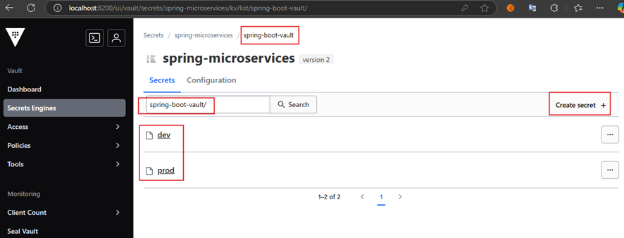

Ahora, cambiamos el perfil de la aplicación en la configuración `spring.profiles.active=prod` del `application.yml` y
ejecutamos la aplicación.

````bash
[spring-boot-vault] [           main] d.m.app.SpringBootVaultApplication       : Starting SpringBootVaultApplication using Java 21.0.1 with PID 11836 (M:\PERSONAL\PROGRAMACION\DESARROLLO_JAVA_SPRING\02.youtube\17.java_tech_solutions\spring-boot-vault\target\classes started by USUARIO in M:\PERSONAL\PROGRAMACION\DESARROLLO_JAVA_SPRING\02.youtube\17.java_tech_solutions\spring-boot-vault)
[spring-boot-vault] [           main] d.m.app.SpringBootVaultApplication       : The following 1 profile is active: "prod"
[spring-boot-vault] [           main] o.s.cloud.context.scope.GenericScope     : BeanFactory id=b1937e46-3c45-3fd7-8628-c62a19080c1b
[spring-boot-vault] [           main] o.s.b.w.embedded.tomcat.TomcatWebServer  : Tomcat initialized with port 8080 (http)
[spring-boot-vault] [           main] o.apache.catalina.core.StandardService   : Starting service [Tomcat]
[spring-boot-vault] [           main] o.apache.catalina.core.StandardEngine    : Starting Servlet engine: [Apache Tomcat/10.1.31]
[spring-boot-vault] [           main] o.a.c.c.C.[Tomcat].[localhost].[/]       : Initializing Spring embedded WebApplicationContext
[spring-boot-vault] [           main] w.s.c.ServletWebServerApplicationContext : Root WebApplicationContext: initialization completed in 2345 ms
[spring-boot-vault] [           main] o.s.b.w.embedded.tomcat.TomcatWebServer  : Tomcat started on port 8080 (http) with context path '/'
[spring-boot-vault] [           main] d.m.app.SpringBootVaultApplication       : Started SpringBootVaultApplication in 6.462 seconds (process running for 7.477)
[spring-boot-vault] [           main] d.m.app.SpringBootVaultApplication       : ----------------------------------------
[spring-boot-vault] [           main] d.m.app.SpringBootVaultApplication       : Configuration properties
[spring-boot-vault] [           main] d.m.app.SpringBootVaultApplication       :    external-api.api-key: 123-abc
[spring-boot-vault] [           main] d.m.app.SpringBootVaultApplication       :    external-api.token: a12asdf5asd6f5
[spring-boot-vault] [           main] d.m.app.SpringBootVaultApplication       :    external-api.username: admin
[spring-boot-vault] [           main] d.m.app.SpringBootVaultApplication       :    external-api.db-password: password-de-produccion
[spring-boot-vault] [           main] d.m.app.SpringBootVaultApplication       :    external-api.db-user: user-de-produccion
[spring-boot-vault] [           main] d.m.app.SpringBootVaultApplication       :    external-api.uri: https://external-api-for-spring-boot-vault.com/v1/
[spring-boot-vault] [           main] d.m.app.SpringBootVaultApplication       : ----------------------------------------
````

## Crea configuraciones para perfil test desde línea de comandos

Podemos aprovechar la `CLI` que nos ofrece `Vault` para crear configuraciones. Aquí entra en juego la importancia de
haber configurado las variables de entorno que configuramos al inicio.

Crearemos un perfil `test` para nuestra aplicación y agregaremos las dos configuraciones `db-password` y `db-user`.

````bash
M:\PERSONAL\PROGRAMACION\DESARROLLO_JAVA_SPRING\02.youtube\17.java_tech_solutions\spring-boot-vault (main)
$ vault kv put spring-microservices/spring-boot-vault/test external-api.db-password=password-test external-api.db-user=user-test
================== Secret Path ==================
spring-microservices/data/spring-boot-vault/test

======= Metadata =======
Key                Value
---                -----
created_time       2024-11-07T01:40:18.4020217Z
custom_metadata    <nil>
deletion_time      n/a
destroyed          false
version            1
````

Si refrescamos la página de `Vault`, nos pedirá que nos volvamos a autenticar. Luego nos dirigimos a nuestro motor
de secretos `spring-microservices` e ingresamos a `spring-boot-vault/` donde veremos nuestro perfil `test` ya creado.
Si ingresamos dentro de dicho perfil veremos las dos propiedades configuradas.

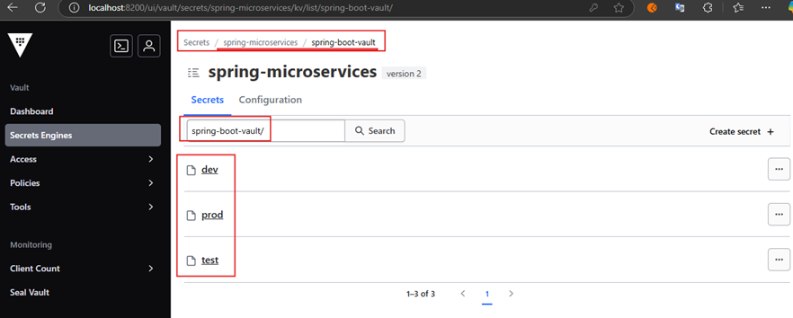

Nuevamente, si ejecutamos la aplicación con el perfil `test` veremos que los datos correspondientes al `db-password`
y `db-user` los está tomando del perfil que acabamos de crear.

````bash
[spring-boot-vault] [           main] d.m.app.SpringBootVaultApplication       : Starting SpringBootVaultApplication using Java 21.0.1 with PID 19536 (M:\PERSONAL\PROGRAMACION\DESARROLLO_JAVA_SPRING\02.youtube\17.java_tech_solutions\spring-boot-vault\target\classes started by USUARIO in M:\PERSONAL\PROGRAMACION\DESARROLLO_JAVA_SPRING\02.youtube\17.java_tech_solutions\spring-boot-vault)
[spring-boot-vault] [           main] d.m.app.SpringBootVaultApplication       : The following 1 profile is active: "test"
[spring-boot-vault] [           main] o.s.cloud.context.scope.GenericScope     : BeanFactory id=b1937e46-3c45-3fd7-8628-c62a19080c1b
[spring-boot-vault] [           main] o.s.b.w.embedded.tomcat.TomcatWebServer  : Tomcat initialized with port 8080 (http)
[spring-boot-vault] [           main] o.apache.catalina.core.StandardService   : Starting service [Tomcat]
[spring-boot-vault] [           main] o.apache.catalina.core.StandardEngine    : Starting Servlet engine: [Apache Tomcat/10.1.31]
[spring-boot-vault] [           main] o.a.c.c.C.[Tomcat].[localhost].[/]       : Initializing Spring embedded WebApplicationContext
[spring-boot-vault] [           main] w.s.c.ServletWebServerApplicationContext : Root WebApplicationContext: initialization completed in 2556 ms
[spring-boot-vault] [           main] o.s.b.w.embedded.tomcat.TomcatWebServer  : Tomcat started on port 8080 (http) with context path '/'
[spring-boot-vault] [           main] d.m.app.SpringBootVaultApplication       : Started SpringBootVaultApplication in 6.741 seconds (process running for 7.668)
[spring-boot-vault] [           main] d.m.app.SpringBootVaultApplication       : ----------------------------------------
[spring-boot-vault] [           main] d.m.app.SpringBootVaultApplication       : Configuration properties
[spring-boot-vault] [           main] d.m.app.SpringBootVaultApplication       :    external-api.api-key: 123-abc
[spring-boot-vault] [           main] d.m.app.SpringBootVaultApplication       :    external-api.token: a12asdf5asd6f5
[spring-boot-vault] [           main] d.m.app.SpringBootVaultApplication       :    external-api.username: admin
[spring-boot-vault] [           main] d.m.app.SpringBootVaultApplication       :    external-api.db-password: password-test
[spring-boot-vault] [           main] d.m.app.SpringBootVaultApplication       :    external-api.db-user: user-test
[spring-boot-vault] [           main] d.m.app.SpringBootVaultApplication       :    external-api.uri: https://external-api-for-spring-boot-vault.com/v1/
[spring-boot-vault] [           main] d.m.app.SpringBootVaultApplication       : ----------------------------------------
````
